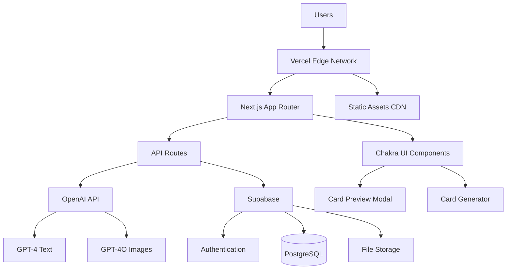
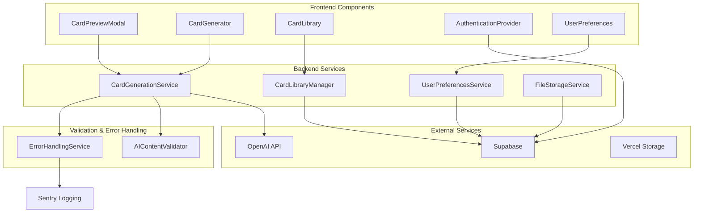
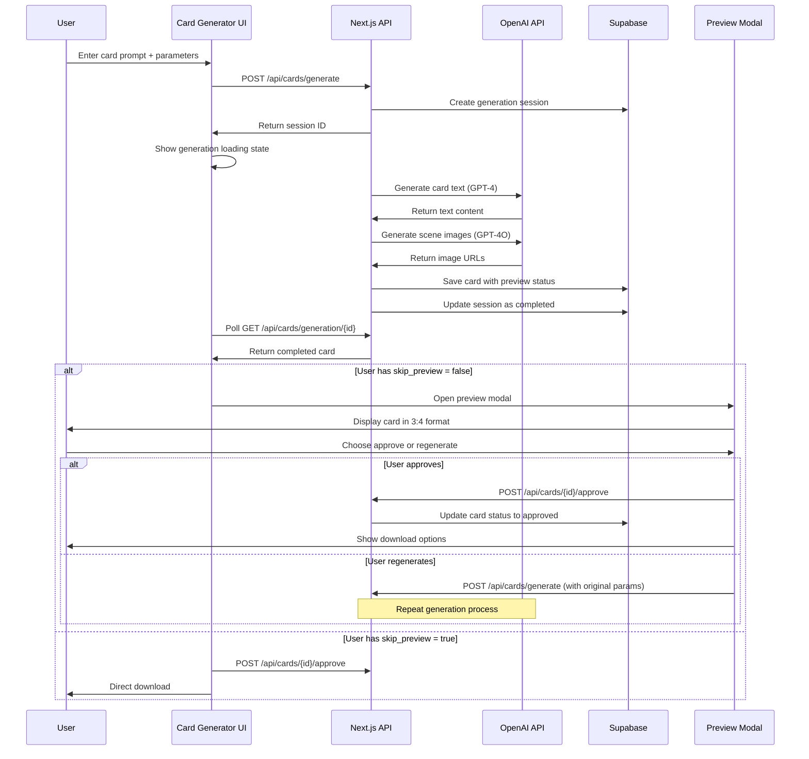
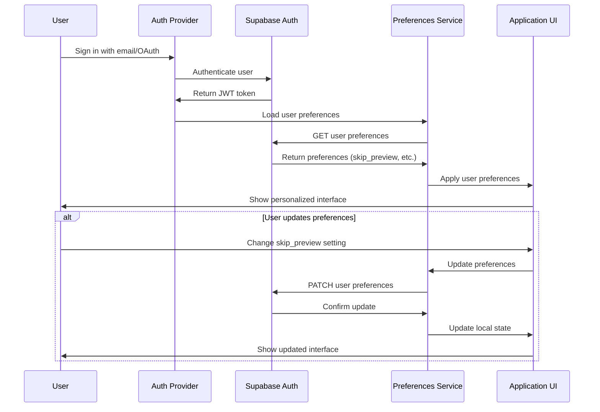
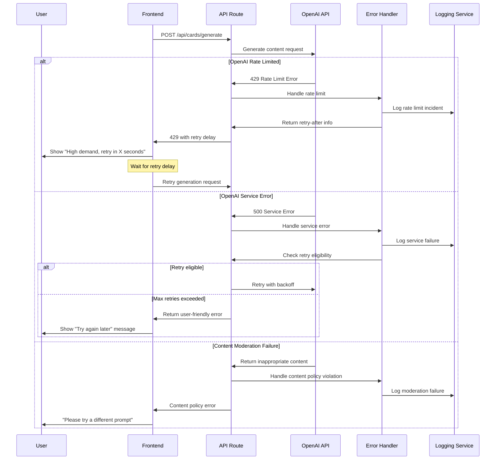
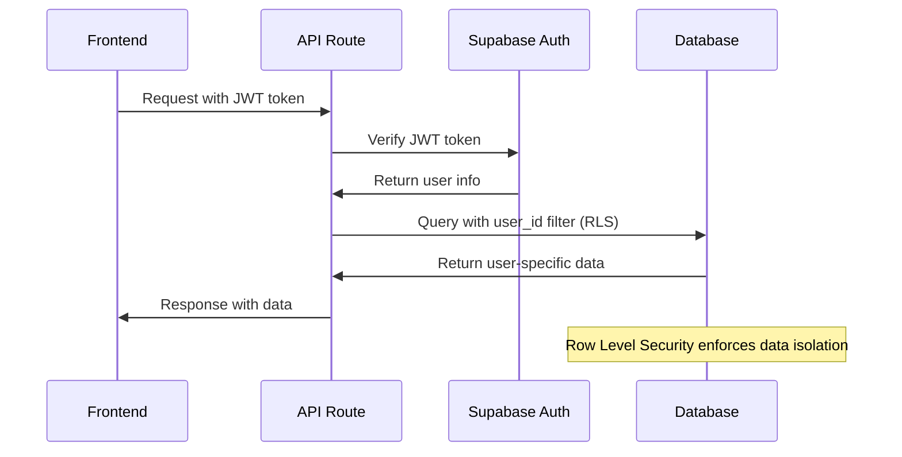
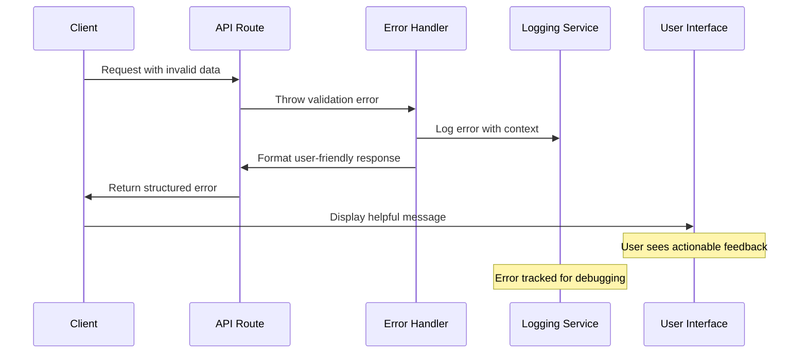

# English Flash Cards Generator Fullstack Architecture Document

## Introduction

This document outlines the complete fullstack architecture for **English Flash Cards Generator**, including backend systems, frontend implementation, and their integration. It serves as the single source of truth for AI-driven development, ensuring consistency across the entire technology stack.

This unified approach combines what would traditionally be separate backend and frontend architecture documents, streamlining the development process for modern fullstack applications where these concerns are increasingly intertwined.

### Starter Template Assessment

**Status:** N/A - Greenfield project  

**Analysis:** Based on the PRD, this is a new English Flash Cards Generator application. However, given the tech stack requirements (Next.js + Chakra UI + Supabase + Vercel), I recommend considering the following starter templates to accelerate development:

1. **Next.js + Supabase Starter** - Official Supabase/Vercel templates with authentication pre-configured
2. **T3 Stack** - TypeScript, Next.js, tRPC, Prisma/Supabase - excellent for type-safe full-stack apps
3. **Chakra UI Templates** - Pre-built layouts and components for educational applications

**Recommendation:** Use Supabase's official Next.js starter as the foundation, then integrate Chakra UI for the component system. This provides authentication, database setup, and Vercel deployment configuration out-of-the-box.

**Architectural Constraints:** The PRD specifies fixed requirements for Next.js, Chakra UI, Supabase, and Vercel deployment, so any starter must be compatible with this tech stack.

### Change Log

| Date | Version | Description | Author |
|------|---------|-------------|--------|
| 2025-09-04 | v1.0 | Initial fullstack architecture document | Winston (Architect) |

## High Level Architecture

### Technical Summary

The English Flash Cards Generator will be built as a **modern Jamstack application** using Next.js with App Router, providing server-side rendering for optimal performance and SEO. The frontend leverages Chakra UI for rapid component development and consistent design, while the backend utilizes **Supabase's serverless architecture** for authentication, PostgreSQL database, and real-time capabilities. **OpenAI API integration** serves as the core AI engine for both text generation (GPT-4) and image generation (GPT-4O), orchestrated through Next.js API routes. The application deploys on **Vercel's edge network** for global performance, with the architecture specifically designed to support the card preview enhancement workflow outlined in the PRD.

### Platform and Infrastructure Choice

**Platform:** Vercel + Supabase
**Key Services:** Vercel Edge Functions, Supabase Database + Auth + Storage, OpenAI API
**Deployment Host and Regions:** Vercel global edge network with primary regions in US-East, EU-West

### Repository Structure

**Structure:** Monorepo with Next.js App Router
**Monorepo Tool:** Native Next.js workspace (no additional tooling needed)
**Package Organization:** Single Next.js application with modular internal structure

### High Level Architecture Diagram



### Architectural Patterns

- **Jamstack Architecture:** Static generation with serverless API routes - *Rationale:* Optimal performance and SEO for educational content with dynamic AI generation capabilities
- **Component-Based UI:** Reusable React components with TypeScript - *Rationale:* Maintainability and type safety across large codebases, essential for educational UI components
- **Serverless API Pattern:** Next.js API routes with edge functions - *Rationale:* Scales automatically with AI processing demands and reduces operational overhead
- **Repository Pattern:** Abstract data access logic through Supabase client - *Rationale:* Enables testing and future database migration flexibility
- **Provider Pattern:** React Context for state management - *Rationale:* Simple state sharing for preview modal and generation workflow without over-engineering
- **API Gateway Pattern:** Centralized API route handling - *Rationale:* Unified error handling, rate limiting, and OpenAI request orchestration

## Tech Stack

### Technology Stack Table

| Category | Technology | Version | Purpose | Rationale |
|----------|------------|---------|---------|-----------|
| Frontend Language | TypeScript | ^5.2.0 | Type-safe development | Essential for maintainable educational software with complex AI integrations |
| Frontend Framework | Next.js | ^14.0.0 | Full-stack React framework | App Router provides optimal performance for content-heavy educational apps |
| UI Component Library | Chakra UI | ^2.8.0 | Component system and design tokens | Accessibility-first design crucial for educational applications |
| State Management | React Context + Zustand | ^4.4.0 | Global state management | Lightweight solution for preview modal and user session state |
| Backend Language | TypeScript | ^5.2.0 | Server-side logic | Shared types between frontend and backend |
| Backend Framework | Next.js API Routes | ^14.0.0 | Serverless API endpoints | Integrated with frontend, optimal for Vercel deployment |
| API Style | REST | OpenAPI 3.0 | API design standard | Simple, well-documented endpoints for AI generation workflow |
| Database | Supabase (PostgreSQL) | Latest | Data persistence + auth | Managed PostgreSQL with built-in authentication and real-time features |
| Cache | Vercel Edge Cache | Built-in | Static asset caching | Integrated caching for generated card assets and static content |
| File Storage | Supabase Storage | Latest | Generated card storage | Integrated with database, handles image uploads and downloads |
| Authentication | Supabase Auth | Latest | User management | OAuth providers, email auth, JWT tokens |
| Frontend Testing | Vitest + React Testing Library | ^1.0.0 / ^14.0.0 | Component testing | Fast unit tests for UI components and hooks |
| Backend Testing | Vitest | ^1.0.0 | API testing | Same testing framework for consistency |
| E2E Testing | Playwright | ^1.40.0 | End-to-end testing | Critical for card generation and preview workflows |
| Build Tool | Next.js | ^14.0.0 | Build pipeline | Integrated build system with Turbopack |
| Bundler | Turbopack | Built-in | Module bundling | Next.js 14 default bundler for fast development |
| IaC Tool | Vercel CLI | Latest | Infrastructure deployment | Infrastructure as code through vercel.json |
| CI/CD | GitHub Actions + Vercel | Latest | Automated deployment | Integrated deployment pipeline |
| Monitoring | Vercel Analytics + Sentry | Latest | Performance and error tracking | User experience monitoring for educational applications |
| Logging | Vercel Functions Logs + Axiom | Latest | Application logging | Structured logging for AI generation debugging |
| CSS Framework | Chakra UI + Emotion | ^2.8.0 | Styling system | CSS-in-JS with design tokens for consistent educational UI |

## Data Models

### User

**Purpose:** Manages user authentication, preferences, and usage tracking for the educational platform

**Key Attributes:**
- id: string (UUID) - Primary identifier
- email: string - Authentication and communication
- name: string - Display name for personalization  
- preferences: UserPreferences - Settings including skip_preview toggle
- subscription_tier: SubscriptionTier - Usage limits and features
- created_at: timestamp - Account creation tracking
- updated_at: timestamp - Last activity tracking

#### TypeScript Interface
```typescript
interface User {
  id: string;
  email: string;
  name: string;
  preferences: UserPreferences;
  subscription_tier: SubscriptionTier;
  created_at: string;
  updated_at: string;
}

interface UserPreferences {
  skip_preview: boolean;
  default_card_type: CardType;
  theme: 'light' | 'dark';
}

type SubscriptionTier = 'free' | 'educator' | 'premium';
```

#### Relationships
- Has many FlashCards
- Has many GenerationSessions

### FlashCard

**Purpose:** Represents generated educational content with both single word and category variations

**Key Attributes:**
- id: string (UUID) - Primary identifier
- user_id: string - Owner reference
- title: string - Card title/primary word
- card_type: CardType - Single word or category card
- content: CardContent - Generated text and image data
- generation_params: GenerationParams - AI generation settings used
- status: CardStatus - Generation and review state
- created_at: timestamp - Generation time
- updated_at: timestamp - Last modification

#### TypeScript Interface
```typescript
interface FlashCard {
  id: string;
  user_id: string;
  title: string;
  card_type: CardType;
  content: CardContent;
  generation_params: GenerationParams;
  status: CardStatus;
  created_at: string;
  updated_at: string;
}

type CardType = 'single_word' | 'category';

interface CardContent {
  primary_word: string;
  scenes: Scene[];
  category_words?: string[]; // For category cards
  layout: CardLayout;
}

interface Scene {
  id: string;
  description: string;
  image_url: string;
  image_prompt: string;
}

type CardStatus = 'generating' | 'preview' | 'approved' | 'downloaded';
```

#### Relationships
- Belongs to User
- Belongs to GenerationSession

### GenerationSession

**Purpose:** Tracks AI generation requests, costs, and batch operations for analytics and billing

**Key Attributes:**
- id: string (UUID) - Primary identifier
- user_id: string - User reference
- input_prompt: string - Original user input
- generation_type: GenerationType - Type of content generated
- ai_costs: AICosts - OpenAI API usage tracking
- status: SessionStatus - Processing state
- error_message: string - Failure details if applicable
- created_at: timestamp - Session start time
- completed_at: timestamp - Session completion time

#### TypeScript Interface
```typescript
interface GenerationSession {
  id: string;
  user_id: string;
  input_prompt: string;
  generation_type: GenerationType;
  ai_costs: AICosts;
  status: SessionStatus;
  error_message?: string;
  created_at: string;
  completed_at?: string;
}

type GenerationType = 'single_word_card' | 'category_card' | 'regeneration';

interface AICosts {
  text_tokens: number;
  image_generations: number;
  total_cost_usd: number;
}

type SessionStatus = 'pending' | 'processing' | 'completed' | 'failed';
```

#### Relationships
- Belongs to User
- Has many FlashCards (for batch generations)

## API Specification

### REST API Specification

```yaml
openapi: 3.0.0
info:
  title: English Flash Cards Generator API
  version: 1.0.0
  description: AI-powered educational flash card generation and management API
servers:
  - url: https://your-app.vercel.app/api
    description: Production server
  - url: http://localhost:3000/api
    description: Development server

paths:
  /auth/session:
    get:
      summary: Get current user session
      security:
        - supabaseAuth: []
      responses:
        '200':
          description: Current user session
          content:
            application/json:
              schema:
                $ref: '#/components/schemas/User'
        '401':
          $ref: '#/components/responses/Unauthorized'

  /cards/generate:
    post:
      summary: Generate new flash card
      security:
        - supabaseAuth: []
      requestBody:
        required: true
        content:
          application/json:
            schema:
              type: object
              properties:
                input_prompt:
                  type: string
                  example: "Animals in the zoo"
                card_type:
                  $ref: '#/components/schemas/CardType'
                generation_params:
                  $ref: '#/components/schemas/GenerationParams'
              required:
                - input_prompt
                - card_type
      responses:
        '200':
          description: Card generation initiated
          content:
            application/json:
              schema:
                $ref: '#/components/schemas/GenerationSession'
        '400':
          $ref: '#/components/responses/BadRequest'
        '401':
          $ref: '#/components/responses/Unauthorized'
        '429':
          $ref: '#/components/responses/RateLimited'

  /cards/generation/{sessionId}:
    get:
      summary: Check generation status
      parameters:
        - name: sessionId
          in: path
          required: true
          schema:
            type: string
      responses:
        '200':
          description: Generation status and results
          content:
            application/json:
              schema:
                allOf:
                  - $ref: '#/components/schemas/GenerationSession'
                  - type: object
                    properties:
                      cards:
                        type: array
                        items:
                          $ref: '#/components/schemas/FlashCard'

  /cards/{cardId}/approve:
    post:
      summary: Approve card after preview
      security:
        - supabaseAuth: []
      parameters:
        - name: cardId
          in: path
          required: true
          schema:
            type: string
      responses:
        '200':
          description: Card approved successfully
          content:
            application/json:
              schema:
                $ref: '#/components/schemas/FlashCard'

  /cards/{cardId}/download:
    get:
      summary: Download generated card
      security:
        - supabaseAuth: []
      parameters:
        - name: cardId
          in: path
          required: true
          schema:
            type: string
        - name: format
          in: query
          schema:
            type: string
            enum: [pdf, png, jpg]
            default: pdf
      responses:
        '200':
          description: Card file download
          content:
            application/pdf:
              schema:
                type: string
                format: binary
            image/png:
              schema:
                type: string
                format: binary

  /cards:
    get:
      summary: Get user's card library
      security:
        - supabaseAuth: []
      parameters:
        - name: page
          in: query
          schema:
            type: integer
            default: 1
        - name: limit
          in: query
          schema:
            type: integer
            default: 20
        - name: card_type
          in: query
          schema:
            $ref: '#/components/schemas/CardType'
      responses:
        '200':
          description: User's card library
          content:
            application/json:
              schema:
                type: object
                properties:
                  cards:
                    type: array
                    items:
                      $ref: '#/components/schemas/FlashCard'
                  pagination:
                    $ref: '#/components/schemas/Pagination'

  /user/preferences:
    get:
      summary: Get user preferences
      security:
        - supabaseAuth: []
      responses:
        '200':
          description: User preferences
          content:
            application/json:
              schema:
                $ref: '#/components/schemas/UserPreferences'
    
    put:
      summary: Update user preferences
      security:
        - supabaseAuth: []
      requestBody:
        required: true
        content:
          application/json:
            schema:
              $ref: '#/components/schemas/UserPreferences'
      responses:
        '200':
          description: Preferences updated
          content:
            application/json:
              schema:
                $ref: '#/components/schemas/UserPreferences'

components:
  securitySchemes:
    supabaseAuth:
      type: http
      scheme: bearer
      bearerFormat: JWT

  schemas:
    User:
      type: object
      properties:
        id:
          type: string
          format: uuid
        email:
          type: string
          format: email
        name:
          type: string
        preferences:
          $ref: '#/components/schemas/UserPreferences'
        subscription_tier:
          type: string
          enum: [free, educator, premium]
        created_at:
          type: string
          format: date-time
        updated_at:
          type: string
          format: date-time

    UserPreferences:
      type: object
      properties:
        skip_preview:
          type: boolean
          default: false
        default_card_type:
          $ref: '#/components/schemas/CardType'
        theme:
          type: string
          enum: [light, dark]
          default: light

    FlashCard:
      type: object
      properties:
        id:
          type: string
          format: uuid
        user_id:
          type: string
          format: uuid
        title:
          type: string
        card_type:
          $ref: '#/components/schemas/CardType'
        content:
          $ref: '#/components/schemas/CardContent'
        generation_params:
          $ref: '#/components/schemas/GenerationParams'
        status:
          type: string
          enum: [generating, preview, approved, downloaded]
        created_at:
          type: string
          format: date-time
        updated_at:
          type: string
          format: date-time

    CardType:
      type: string
      enum: [single_word, category]

    CardContent:
      type: object
      properties:
        primary_word:
          type: string
        scenes:
          type: array
          items:
            $ref: '#/components/schemas/Scene'
        category_words:
          type: array
          items:
            type: string
        layout:
          $ref: '#/components/schemas/CardLayout'

    Scene:
      type: object
      properties:
        id:
          type: string
        description:
          type: string
        image_url:
          type: string
          format: uri
        image_prompt:
          type: string

    CardLayout:
      type: object
      properties:
        format:
          type: string
          enum: ["3:4"]
        orientation:
          type: string
          enum: [portrait, landscape]
        theme:
          type: string
          enum: [bright, colorful, minimal]

    GenerationSession:
      type: object
      properties:
        id:
          type: string
          format: uuid
        user_id:
          type: string
          format: uuid
        input_prompt:
          type: string
        generation_type:
          type: string
          enum: [single_word_card, category_card, regeneration]
        ai_costs:
          $ref: '#/components/schemas/AICosts'
        status:
          type: string
          enum: [pending, processing, completed, failed]
        error_message:
          type: string
        created_at:
          type: string
          format: date-time
        completed_at:
          type: string
          format: date-time

    GenerationParams:
      type: object
      properties:
        difficulty_level:
          type: string
          enum: [beginner, intermediate, advanced]
        age_group:
          type: string
          enum: [preschool, elementary, middle_school]
        style_preference:
          type: string
          enum: [cartoon, realistic, minimalist]
        language:
          type: string
          default: "en"

    AICosts:
      type: object
      properties:
        text_tokens:
          type: integer
        image_generations:
          type: integer
        total_cost_usd:
          type: number
          format: decimal

    Pagination:
      type: object
      properties:
        page:
          type: integer
        limit:
          type: integer
        total:
          type: integer
        total_pages:
          type: integer

    Error:
      type: object
      properties:
        error:
          type: object
          properties:
            code:
              type: string
            message:
              type: string
            details:
              type: object
            timestamp:
              type: string
              format: date-time
            requestId:
              type: string

  responses:
    BadRequest:
      description: Bad request
      content:
        application/json:
          schema:
            $ref: '#/components/schemas/Error'
    
    Unauthorized:
      description: Unauthorized
      content:
        application/json:
          schema:
            $ref: '#/components/schemas/Error'
    
    RateLimited:
      description: Rate limit exceeded
      content:
        application/json:
          schema:
            $ref: '#/components/schemas/Error'
```

## Components

### CardGenerationService

**Responsibility:** Orchestrates AI-powered card generation workflow including OpenAI API integration, content validation, and generation session management

**Key Interfaces:**
- `generateCard(prompt: string, params: GenerationParams): Promise<GenerationSession>`
- `checkGenerationStatus(sessionId: string): Promise<GenerationSession>`
- `regenerateCard(cardId: string): Promise<GenerationSession>`

**Dependencies:** OpenAI API, Supabase Database, Image Storage Service

**Technology Stack:** Next.js API Routes, OpenAI SDK, Supabase client, TypeScript

### CardPreviewModal

**Responsibility:** Frontend component for displaying generated cards with 3:4 aspect ratio, providing approve/regenerate actions as specified in PRD

**Key Interfaces:**
- `PreviewModalProps { card: FlashCard, onApprove: () => void, onRegenerate: () => void }`
- `usePreviewState() => { isOpen, card, actions }`

**Dependencies:** Chakra UI Modal, Card Display Component, Generation Service

**Technology Stack:** React, TypeScript, Chakra UI, Zustand for modal state

### AuthenticationProvider

**Responsibility:** Manages user authentication state, session persistence, and authorization across the application

**Key Interfaces:**
- `AuthContext { user: User | null, signIn, signOut, updatePreferences }`
- `useAuth() => AuthState`
- `withAuth(Component) => AuthenticatedComponent`

**Dependencies:** Supabase Auth, React Context

**Technology Stack:** React Context, Supabase Auth SDK, TypeScript

### CardLibraryManager

**Responsibility:** Handles card storage, retrieval, organization, and download functionality for user's card collection

**Key Interfaces:**
- `saveCard(card: FlashCard): Promise<FlashCard>`
- `getUserCards(userId: string, pagination: Pagination): Promise<CardLibrary>`
- `downloadCard(cardId: string, format: FileFormat): Promise<Blob>`

**Dependencies:** Supabase Database, File Storage Service, PDF Generation Service

**Technology Stack:** Supabase client, jsPDF for PDF generation, TypeScript

### UserPreferencesService

**Responsibility:** Manages user settings including skip_preview toggle, card preferences, and application configuration

**Key Interfaces:**
- `getPreferences(userId: string): Promise<UserPreferences>`
- `updatePreferences(userId: string, prefs: Partial<UserPreferences>): Promise<UserPreferences>`
- `getSkipPreview(userId: string): Promise<boolean>`

**Dependencies:** Supabase Database, Authentication Provider

**Technology Stack:** Supabase client, React Query for caching, TypeScript

### AIContentValidator

**Responsibility:** Validates and sanitizes AI-generated content for educational appropriateness and quality standards

**Key Interfaces:**
- `validateCardContent(content: CardContent): ValidationResult`
- `sanitizeText(text: string): string`
- `checkImageAppropriate(imageUrl: string): Promise<boolean>`

**Dependencies:** Content moderation APIs, OpenAI moderation endpoint

**Technology Stack:** OpenAI Moderation API, custom validation rules, TypeScript

### FileStorageService

**Responsibility:** Manages image upload, storage, optimization, and CDN distribution for generated card assets

**Key Interfaces:**
- `uploadImage(file: File, metadata: ImageMetadata): Promise<string>`
- `optimizeImage(imageUrl: string): Promise<string>`
- `generateDownloadUrl(cardId: string, format: string): Promise<string>`

**Dependencies:** Supabase Storage, Image optimization service

**Technology Stack:** Supabase Storage SDK, Sharp for image processing, TypeScript

### ErrorHandlingService

**Responsibility:** Centralized error handling, logging, and user-friendly error message translation for AI generation failures

**Key Interfaces:**
- `handleAPIError(error: Error): UserFriendlyError`
- `logGenerationError(sessionId: string, error: Error): void`
- `retryGeneration(sessionId: string): Promise<GenerationSession>`

**Dependencies:** Logging service, Notification system

**Technology Stack:** Sentry for error tracking, custom error types, TypeScript

### Component Diagrams



## External APIs

### OpenAI API

- **Purpose:** AI-powered text and image generation for educational flash cards
- **Documentation:** https://platform.openai.com/docs/api-reference
- **Base URL(s):** https://api.openai.com/v1
- **Authentication:** Bearer token (API key)
- **Rate Limits:** 
  - GPT-4: 10,000 TPM (tokens per minute)
  - GPT-4O: 7 images per minute
  - Organization-level quotas apply

**Key Endpoints Used:**
- `POST /chat/completions` - Generate card text content and scene descriptions
- `POST /images/generations` - Generate educational scene images with DALL-E
- `POST /moderations` - Content safety validation for educational appropriateness

**Integration Notes:** Implement exponential backoff for rate limiting, cache generation parameters to avoid duplicate calls, use streaming for text generation to improve perceived performance

### Supabase API

- **Purpose:** Authentication, database operations, and file storage for user data and generated content
- **Documentation:** https://supabase.com/docs/reference/javascript
- **Base URL(s):** https://your-project.supabase.co
- **Authentication:** JWT tokens, API keys
- **Rate Limits:** 
  - Database: 500 requests per second
  - Auth: 30 requests per hour per IP for signup
  - Storage: 100MB per file, 2GB total per project

**Key Endpoints Used:**
- `POST /auth/v1/token` - User authentication and session management
- `GET/POST/PATCH /rest/v1/flash_cards` - Card CRUD operations
- `POST /storage/v1/object/{bucket}` - Image file upload and management

**Integration Notes:** Use row-level security (RLS) for data isolation, implement real-time subscriptions for generation status updates, optimize storage with image compression pipeline

### Vercel Analytics API

- **Purpose:** Performance monitoring and user behavior analytics for educational application optimization
- **Documentation:** https://vercel.com/docs/analytics
- **Base URL(s):** Built-in Vercel deployment integration
- **Authentication:** Automatic with Vercel deployment
- **Rate Limits:** No explicit limits (usage-based billing)

**Key Endpoints Used:**
- Built-in Web Vitals tracking for card preview performance
- Custom event tracking for generation workflow completion rates
- Error rate monitoring for AI service failures

**Integration Notes:** Track card generation success rates, preview engagement metrics, and download conversion rates for product optimization

## Core Workflows

### Card Generation with Preview Workflow



### User Authentication and Preferences Flow



### Error Handling and Retry Workflow



## Database Schema

```sql
-- Enable UUID extension
CREATE EXTENSION IF NOT EXISTS "uuid-ossp";

-- Enable Row Level Security
ALTER DATABASE postgres SET row_security = on;

-- Users table (extends Supabase auth.users)
CREATE TABLE public.users (
    id UUID REFERENCES auth.users(id) ON DELETE CASCADE PRIMARY KEY,
    email TEXT NOT NULL,
    name TEXT NOT NULL,
    subscription_tier TEXT CHECK (subscription_tier IN ('free', 'educator', 'premium')) DEFAULT 'free',
    created_at TIMESTAMP WITH TIME ZONE DEFAULT NOW(),
    updated_at TIMESTAMP WITH TIME ZONE DEFAULT NOW()
);

-- User preferences table
CREATE TABLE public.user_preferences (
    id UUID DEFAULT uuid_generate_v4() PRIMARY KEY,
    user_id UUID REFERENCES public.users(id) ON DELETE CASCADE NOT NULL,
    skip_preview BOOLEAN DEFAULT false,
    default_card_type TEXT CHECK (default_card_type IN ('single_word', 'category')) DEFAULT 'single_word',
    theme TEXT CHECK (theme IN ('light', 'dark')) DEFAULT 'light',
    created_at TIMESTAMP WITH TIME ZONE DEFAULT NOW(),
    updated_at TIMESTAMP WITH TIME ZONE DEFAULT NOW(),
    UNIQUE(user_id)
);

-- Generation sessions table
CREATE TABLE public.generation_sessions (
    id UUID DEFAULT uuid_generate_v4() PRIMARY KEY,
    user_id UUID REFERENCES public.users(id) ON DELETE CASCADE NOT NULL,
    input_prompt TEXT NOT NULL,
    generation_type TEXT CHECK (generation_type IN ('single_word_card', 'category_card', 'regeneration')) NOT NULL,
    status TEXT CHECK (status IN ('pending', 'processing', 'completed', 'failed')) DEFAULT 'pending',
    error_message TEXT,
    ai_costs JSONB DEFAULT '{"text_tokens": 0, "image_generations": 0, "total_cost_usd": 0.0}',
    created_at TIMESTAMP WITH TIME ZONE DEFAULT NOW(),
    completed_at TIMESTAMP WITH TIME ZONE,
    INDEX (user_id, created_at DESC),
    INDEX (status, created_at)
);

-- Flash cards table
CREATE TABLE public.flash_cards (
    id UUID DEFAULT uuid_generate_v4() PRIMARY KEY,
    user_id UUID REFERENCES public.users(id) ON DELETE CASCADE NOT NULL,
    session_id UUID REFERENCES public.generation_sessions(id) ON DELETE SET NULL,
    title TEXT NOT NULL,
    card_type TEXT CHECK (card_type IN ('single_word', 'category')) NOT NULL,
    status TEXT CHECK (status IN ('generating', 'preview', 'approved', 'downloaded')) DEFAULT 'generating',
    content JSONB NOT NULL,
    generation_params JSONB NOT NULL DEFAULT '{}',
    created_at TIMESTAMP WITH TIME ZONE DEFAULT NOW(),
    updated_at TIMESTAMP WITH TIME ZONE DEFAULT NOW(),
    INDEX (user_id, created_at DESC),
    INDEX (user_id, card_type),
    INDEX (status, created_at)
);

-- Card scenes table (normalized for better querying and storage efficiency)
CREATE TABLE public.card_scenes (
    id UUID DEFAULT uuid_generate_v4() PRIMARY KEY,
    card_id UUID REFERENCES public.flash_cards(id) ON DELETE CASCADE NOT NULL,
    scene_order INTEGER NOT NULL,
    description TEXT NOT NULL,
    image_url TEXT,
    image_prompt TEXT NOT NULL,
    created_at TIMESTAMP WITH TIME ZONE DEFAULT NOW(),
    UNIQUE(card_id, scene_order),
    INDEX (card_id, scene_order)
);

-- User usage tracking for quotas and billing
CREATE TABLE public.usage_tracking (
    id UUID DEFAULT uuid_generate_v4() PRIMARY KEY,
    user_id UUID REFERENCES public.users(id) ON DELETE CASCADE NOT NULL,
    period_start DATE NOT NULL,
    period_end DATE NOT NULL,
    cards_generated INTEGER DEFAULT 0,
    total_ai_cost DECIMAL(10,4) DEFAULT 0.0000,
    created_at TIMESTAMP WITH TIME ZONE DEFAULT NOW(),
    updated_at TIMESTAMP WITH TIME ZONE DEFAULT NOW(),
    UNIQUE(user_id, period_start),
    INDEX (user_id, period_start DESC)
);

-- Row Level Security Policies

-- Users can only see their own data
CREATE POLICY "Users can view own profile" ON public.users
    FOR SELECT USING (auth.uid() = id);

CREATE POLICY "Users can update own profile" ON public.users
    FOR UPDATE USING (auth.uid() = id);

-- User preferences policies
CREATE POLICY "Users can manage own preferences" ON public.user_preferences
    FOR ALL USING (auth.uid() = user_id);

-- Generation sessions policies
CREATE POLICY "Users can view own sessions" ON public.generation_sessions
    FOR SELECT USING (auth.uid() = user_id);

CREATE POLICY "Users can create own sessions" ON public.generation_sessions
    FOR INSERT WITH CHECK (auth.uid() = user_id);

CREATE POLICY "Users can update own sessions" ON public.generation_sessions
    FOR UPDATE USING (auth.uid() = user_id);

-- Flash cards policies
CREATE POLICY "Users can manage own cards" ON public.flash_cards
    FOR ALL USING (auth.uid() = user_id);

-- Card scenes policies
CREATE POLICY "Users can manage scenes of own cards" ON public.card_scenes
    FOR ALL USING (
        EXISTS (
            SELECT 1 FROM public.flash_cards 
            WHERE flash_cards.id = card_scenes.card_id 
            AND flash_cards.user_id = auth.uid()
        )
    );

-- Usage tracking policies
CREATE POLICY "Users can view own usage" ON public.usage_tracking
    FOR SELECT USING (auth.uid() = user_id);

-- Enable RLS on all tables
ALTER TABLE public.users ENABLE ROW LEVEL SECURITY;
ALTER TABLE public.user_preferences ENABLE ROW LEVEL SECURITY;
ALTER TABLE public.generation_sessions ENABLE ROW LEVEL SECURITY;
ALTER TABLE public.flash_cards ENABLE ROW LEVEL SECURITY;
ALTER TABLE public.card_scenes ENABLE ROW LEVEL SECURITY;
ALTER TABLE public.usage_tracking ENABLE ROW LEVEL SECURITY;

-- Functions and Triggers

-- Updated timestamp trigger function
CREATE OR REPLACE FUNCTION public.handle_updated_at()
RETURNS TRIGGER AS $$
BEGIN
    NEW.updated_at = NOW();
    RETURN NEW;
END;
$$ LANGUAGE plpgsql;

-- Apply updated_at triggers
CREATE TRIGGER handle_users_updated_at
    BEFORE UPDATE ON public.users
    FOR EACH ROW EXECUTE FUNCTION public.handle_updated_at();

CREATE TRIGGER handle_preferences_updated_at
    BEFORE UPDATE ON public.user_preferences
    FOR EACH ROW EXECUTE FUNCTION public.handle_updated_at();

CREATE TRIGGER handle_cards_updated_at
    BEFORE UPDATE ON public.flash_cards
    FOR EACH ROW EXECUTE FUNCTION public.handle_updated_at();

CREATE TRIGGER handle_usage_updated_at
    BEFORE UPDATE ON public.usage_tracking
    FOR EACH ROW EXECUTE FUNCTION public.handle_updated_at();

-- Function to create user preferences on signup
CREATE OR REPLACE FUNCTION public.handle_new_user()
RETURNS TRIGGER AS $$
BEGIN
    INSERT INTO public.user_preferences (user_id)
    VALUES (NEW.id);
    RETURN NEW;
END;
$$ LANGUAGE plpgsql;

-- Trigger to create preferences when user is created
CREATE TRIGGER on_auth_user_created
    AFTER INSERT ON public.users
    FOR EACH ROW EXECUTE FUNCTION public.handle_new_user();

-- Indexes for performance optimization
CREATE INDEX CONCURRENTLY idx_flash_cards_user_status ON public.flash_cards(user_id, status, created_at DESC);
CREATE INDEX CONCURRENTLY idx_sessions_user_type ON public.generation_sessions(user_id, generation_type, created_at DESC);
CREATE INDEX CONCURRENTLY idx_usage_period ON public.usage_tracking(user_id, period_start DESC);

-- Views for common queries
CREATE VIEW public.user_card_summary AS
SELECT 
    u.id as user_id,
    u.name,
    COUNT(fc.id) as total_cards,
    COUNT(CASE WHEN fc.status = 'approved' THEN 1 END) as approved_cards,
    COUNT(CASE WHEN fc.status = 'downloaded' THEN 1 END) as downloaded_cards,
    MAX(fc.created_at) as last_card_created
FROM public.users u
LEFT JOIN public.flash_cards fc ON u.id = fc.user_id
GROUP BY u.id, u.name;
```

## Frontend Architecture

### Component Architecture

#### Component Organization
```
src/
├── components/
│   ├── ui/                     # Chakra UI base components
│   │   ├── Button/
│   │   ├── Modal/
│   │   └── Card/
│   ├── cards/                  # Card-specific components
│   │   ├── CardGenerator/
│   │   ├── CardPreview/
│   │   ├── CardLibrary/
│   │   └── CardDownload/
│   ├── auth/                   # Authentication components
│   │   ├── LoginForm/
│   │   ├── SignupForm/
│   │   └── AuthGuard/
│   ├── layout/                 # Layout components
│   │   ├── Header/
│   │   ├── Navigation/
│   │   └── Footer/
│   └── forms/                  # Reusable form components
│       ├── GenerationForm/
│       └── PreferencesForm/
├── hooks/                      # Custom React hooks
│   ├── useAuth.ts
│   ├── useCardGeneration.ts
│   ├── usePreview.ts
│   └── usePreferences.ts
├── stores/                     # Zustand stores
│   ├── authStore.ts
│   ├── cardStore.ts
│   └── uiStore.ts
├── services/                   # API service layer
│   ├── api/
│   │   ├── cards.ts
│   │   ├── auth.ts
│   │   └── preferences.ts
│   └── utils/
└── types/                      # TypeScript type definitions
    ├── api.ts
    ├── cards.ts
    └── user.ts
```

#### Component Template
```typescript
// components/cards/CardPreview/CardPreview.tsx
import React from 'react';
import {
  Modal,
  ModalOverlay,
  ModalContent,
  ModalBody,
  ModalFooter,
  Button,
  AspectRatio,
  VStack,
  HStack,
  Text,
  Image,
  Grid,
  GridItem,
  useDisclosure
} from '@chakra-ui/react';
import { FlashCard } from '@/types/cards';
import { useCardGeneration } from '@/hooks/useCardGeneration';

interface CardPreviewProps {
  card: FlashCard;
  isOpen: boolean;
  onClose: () => void;
  onApprove: (cardId: string) => Promise<void>;
  onRegenerate: (cardId: string) => Promise<void>;
}

export const CardPreview: React.FC<CardPreviewProps> = ({
  card,
  isOpen,
  onClose,
  onApprove,
  onRegenerate
}) => {
  const { isProcessing } = useCardGeneration();

  const handleApprove = async () => {
    await onApprove(card.id);
    onClose();
  };

  const handleRegenerate = async () => {
    await onRegenerate(card.id);
    onClose();
  };

  return (
    <Modal 
      isOpen={isOpen} 
      onClose={onClose} 
      size="2xl"
      motionPreset="slideInBottom"
    >
      <ModalOverlay bg="blackAlpha.600" />
      <ModalContent maxW="600px">
        <ModalBody p={6}>
          <VStack spacing={4} align="stretch">
            <Text fontSize="xl" fontWeight="bold" textAlign="center">
              Preview: {card.title}
            </Text>
            
            {/* 3:4 Aspect Ratio Card Display */}
            <AspectRatio ratio={3/4} bg="gray.50" borderRadius="lg">
              <Grid templateColumns="1fr 1fr" templateRows="1fr 1fr" gap={2} p={4}>
                {card.content.scenes.map((scene, index) => (
                  <GridItem key={scene.id}>
                    <VStack spacing={2} h="full">
                      <Image
                        src={scene.image_url}
                        alt={scene.description}
                        borderRadius="md"
                        objectFit="cover"
                        w="full"
                        flex={1}
                      />
                      <Text fontSize="sm" textAlign="center" noOfLines={2}>
                        {scene.description}
                      </Text>
                    </VStack>
                  </GridItem>
                ))}
              </Grid>
            </AspectRatio>
            
            <Text fontSize="lg" fontWeight="semibold" textAlign="center">
              {card.content.primary_word}
            </Text>
          </VStack>
        </ModalBody>
        
        <ModalFooter>
          <HStack spacing={3} w="full" justify="center">
            <Button variant="ghost" onClick={onClose}>
              Cancel
            </Button>
            <Button
              colorScheme="orange"
              variant="outline"
              onClick={handleRegenerate}
              isLoading={isProcessing}
              loadingText="Regenerating..."
            >
              Regenerate
            </Button>
            <Button
              colorScheme="green"
              onClick={handleApprove}
              isLoading={isProcessing}
              loadingText="Processing..."
            >
              Approve & Download
            </Button>
          </HStack>
        </ModalFooter>
      </ModalContent>
    </Modal>
  );
};

export default CardPreview;
```

### State Management Architecture

#### State Structure
```typescript
// stores/cardStore.ts
import { create } from 'zustand';
import { devtools, persist } from 'zustand/middleware';
import { FlashCard, GenerationSession } from '@/types/cards';

interface CardState {
  // Current generation
  currentSession: GenerationSession | null;
  generatedCard: FlashCard | null;
  isGenerating: boolean;
  
  // Preview modal
  previewCard: FlashCard | null;
  isPreviewOpen: boolean;
  
  // Card library
  userCards: FlashCard[];
  totalCards: number;
  currentPage: number;
  
  // Actions
  startGeneration: (prompt: string, params: GenerationParams) => Promise<void>;
  checkGenerationStatus: (sessionId: string) => Promise<void>;
  openPreview: (card: FlashCard) => void;
  closePreview: () => void;
  approveCard: (cardId: string) => Promise<void>;
  regenerateCard: (cardId: string) => Promise<void>;
  loadUserCards: (page?: number) => Promise<void>;
  
  // Error handling
  error: string | null;
  setError: (error: string | null) => void;
}

export const useCardStore = create<CardState>()(
  devtools(
    persist(
      (set, get) => ({
        // Initial state
        currentSession: null,
        generatedCard: null,
        isGenerating: false,
        previewCard: null,
        isPreviewOpen: false,
        userCards: [],
        totalCards: 0,
        currentPage: 1,
        error: null,

        // Actions
        startGeneration: async (prompt: string, params: GenerationParams) => {
          set({ isGenerating: true, error: null });
          try {
            const session = await cardService.generateCard(prompt, params);
            set({ currentSession: session });
            
            // Poll for completion
            get().checkGenerationStatus(session.id);
          } catch (error) {
            set({ error: error.message, isGenerating: false });
          }
        },

        checkGenerationStatus: async (sessionId: string) => {
          try {
            const session = await cardService.getGenerationStatus(sessionId);
            set({ currentSession: session });
            
            if (session.status === 'completed' && session.cards?.[0]) {
              const card = session.cards[0];
              set({ 
                generatedCard: card,
                isGenerating: false,
                previewCard: card,
                isPreviewOpen: !userPreferences.skip_preview 
              });
            } else if (session.status === 'failed') {
              set({ error: session.error_message, isGenerating: false });
            } else if (session.status === 'processing') {
              // Continue polling
              setTimeout(() => get().checkGenerationStatus(sessionId), 2000);
            }
          } catch (error) {
            set({ error: error.message, isGenerating: false });
          }
        },

        openPreview: (card: FlashCard) => {
          set({ previewCard: card, isPreviewOpen: true });
        },

        closePreview: () => {
          set({ previewCard: null, isPreviewOpen: false });
        },

        approveCard: async (cardId: string) => {
          try {
            await cardService.approveCard(cardId);
            set({ isPreviewOpen: false });
            // Refresh user cards
            get().loadUserCards();
          } catch (error) {
            set({ error: error.message });
          }
        },

        regenerateCard: async (cardId: string) => {
          const card = get().previewCard;
          if (card?.generation_params) {
            set({ isPreviewOpen: false });
            get().startGeneration(card.title, card.generation_params);
          }
        },

        loadUserCards: async (page = 1) => {
          try {
            const response = await cardService.getUserCards({ page, limit: 20 });
            set({ 
              userCards: response.cards,
              totalCards: response.pagination.total,
              currentPage: page 
            });
          } catch (error) {
            set({ error: error.message });
          }
        },

        setError: (error: string | null) => {
          set({ error });
        }
      }),
      {
        name: 'card-store',
        // Only persist user cards and current page
        partialize: (state) => ({
          userCards: state.userCards,
          currentPage: state.currentPage,
          totalCards: state.totalCards
        })
      }
    )
  )
);
```

#### State Management Patterns
- **Single Source of Truth:** Zustand stores manage all application state centrally
- **Derived State:** Component-level derived state using useMemo for computed values
- **Optimistic Updates:** UI updates immediately, with rollback on API failure
- **Persistence:** User cards and preferences cached locally for offline viewing
- **Error Boundaries:** React Error Boundaries catch and handle component errors

### Routing Architecture

#### Route Organization
```
app/
├── (auth)/
│   ├── login/
│   │   └── page.tsx
│   ├── signup/
│   │   └── page.tsx
│   └── layout.tsx
├── (dashboard)/
│   ├── generate/
│   │   └── page.tsx
│   ├── library/
│   │   └── page.tsx
│   ├── settings/
│   │   └── page.tsx
│   └── layout.tsx
├── layout.tsx
├── page.tsx
└── not-found.tsx
```

#### Protected Route Pattern
```typescript
// components/auth/AuthGuard.tsx
import { ReactNode } from 'react';
import { useRouter } from 'next/navigation';
import { useAuth } from '@/hooks/useAuth';
import { Spinner, Center, VStack, Text } from '@chakra-ui/react';

interface AuthGuardProps {
  children: ReactNode;
  fallback?: ReactNode;
}

export const AuthGuard: React.FC<AuthGuardProps> = ({ 
  children, 
  fallback 
}) => {
  const { user, loading } = useAuth();
  const router = useRouter();

  if (loading) {
    return (
      <Center h="100vh">
        <VStack spacing={4}>
          <Spinner size="xl" color="blue.500" />
          <Text>Loading your account...</Text>
        </VStack>
      </Center>
    );
  }

  if (!user) {
    router.push('/login');
    return fallback || null;
  }

  return <>{children}</>;
};

// app/(dashboard)/layout.tsx
import { AuthGuard } from '@/components/auth/AuthGuard';
import { DashboardLayout } from '@/components/layout/DashboardLayout';

export default function DashboardLayout({
  children,
}: {
  children: React.ReactNode;
}) {
  return (
    <AuthGuard>
      <DashboardLayout>
        {children}
      </DashboardLayout>
    </AuthGuard>
  );
}
```

### Frontend Services Layer

#### API Client Setup
```typescript
// services/api/client.ts
import { createClient } from '@supabase/supabase-js';
import { Database } from '@/types/database';

const supabaseUrl = process.env.NEXT_PUBLIC_SUPABASE_URL!;
const supabaseAnonKey = process.env.NEXT_PUBLIC_SUPABASE_ANON_KEY!;

export const supabase = createClient<Database>(supabaseUrl, supabaseAnonKey);

// API client with auth and error handling
class ApiClient {
  private async request<T>(
    endpoint: string, 
    options: RequestInit = {}
  ): Promise<T> {
    const { data: { session } } = await supabase.auth.getSession();
    
    const response = await fetch(`/api${endpoint}`, {
      headers: {
        'Content-Type': 'application/json',
        ...(session?.access_token && {
          Authorization: `Bearer ${session.access_token}`
        }),
        ...options.headers,
      },
      ...options,
    });

    if (!response.ok) {
      const error = await response.json();
      throw new Error(error.message || 'API request failed');
    }

    return response.json();
  }

  get<T>(endpoint: string): Promise<T> {
    return this.request<T>(endpoint);
  }

  post<T>(endpoint: string, data?: any): Promise<T> {
    return this.request<T>(endpoint, {
      method: 'POST',
      body: data ? JSON.stringify(data) : undefined,
    });
  }

  put<T>(endpoint: string, data?: any): Promise<T> {
    return this.request<T>(endpoint, {
      method: 'PUT',
      body: data ? JSON.stringify(data) : undefined,
    });
  }

  patch<T>(endpoint: string, data?: any): Promise<T> {
    return this.request<T>(endpoint, {
      method: 'PATCH',
      body: data ? JSON.stringify(data) : undefined,
    });
  }
}

export const apiClient = new ApiClient();
```

#### Service Example
```typescript
// services/api/cards.ts
import { apiClient } from './client';
import { FlashCard, GenerationSession, GenerationParams } from '@/types/cards';

export const cardService = {
  generateCard: async (
    prompt: string, 
    params: GenerationParams
  ): Promise<GenerationSession> => {
    return apiClient.post('/cards/generate', { 
      input_prompt: prompt, 
      card_type: params.card_type,
      generation_params: params 
    });
  },

  getGenerationStatus: async (sessionId: string): Promise<GenerationSession> => {
    return apiClient.get(`/cards/generation/${sessionId}`);
  },

  approveCard: async (cardId: string): Promise<FlashCard> => {
    return apiClient.post(`/cards/${cardId}/approve`);
  },

  getUserCards: async (pagination: { page: number; limit: number }) => {
    const params = new URLSearchParams({
      page: pagination.page.toString(),
      limit: pagination.limit.toString(),
    });
    return apiClient.get(`/cards?${params}`);
  },

  downloadCard: async (cardId: string, format: 'pdf' | 'png' = 'pdf') => {
    const response = await fetch(`/api/cards/${cardId}/download?format=${format}`, {
      headers: {
        Authorization: `Bearer ${(await supabase.auth.getSession()).data.session?.access_token}`
      }
    });
    return response.blob();
  }
};
```

## Backend Architecture

### Service Architecture

#### Function Organization
```
api/
├── auth/
│   ├── session.ts              # GET /api/auth/session
│   └── callback.ts             # POST /api/auth/callback
├── cards/
│   ├── generate.ts             # POST /api/cards/generate
│   ├── generation/
│   │   └── [sessionId].ts      # GET /api/cards/generation/{sessionId}
│   ├── [cardId]/
│   │   ├── approve.ts          # POST /api/cards/{cardId}/approve
│   │   └── download.ts         # GET /api/cards/{cardId}/download
│   └── index.ts                # GET /api/cards (user library)
├── user/
│   └── preferences.ts          # GET/PUT /api/user/preferences
├── webhooks/
│   └── openai.ts               # POST /api/webhooks/openai
└── lib/
    ├── auth.ts                 # Authentication utilities
    ├── openai.ts               # OpenAI service client
    ├── supabase.ts             # Database client
    ├── errors.ts               # Error handling utilities
    └── validation.ts           # Request validation schemas
```

#### Function Template
```typescript
// api/cards/generate.ts
import { NextRequest, NextResponse } from 'next/server';
import { z } from 'zod';
import { createServerClient } from '@supabase/ssr';
import { OpenAIService } from '@/lib/openai';
import { validateRequest } from '@/lib/validation';
import { handleAPIError } from '@/lib/errors';

// Request validation schema
const GenerateCardSchema = z.object({
  input_prompt: z.string().min(1).max(200),
  card_type: z.enum(['single_word', 'category']),
  generation_params: z.object({
    difficulty_level: z.enum(['beginner', 'intermediate', 'advanced']).default('beginner'),
    age_group: z.enum(['preschool', 'elementary', 'middle_school']).default('elementary'),
    style_preference: z.enum(['cartoon', 'realistic', 'minimalist']).default('cartoon'),
    language: z.string().default('en')
  }).optional().default({})
});

export async function POST(request: NextRequest) {
  try {
    // Validate request and authenticate user
    const { data, user } = await validateRequest(request, GenerateCardSchema);
    
    // Create Supabase client for this request
    const supabase = createServerClient(
      process.env.SUPABASE_URL!,
      process.env.SUPABASE_SERVICE_KEY!,
      {
        cookies: {
          get: (name: string) => request.cookies.get(name)?.value,
        },
      }
    );

    // Check user's generation quota
    const quotaCheck = await checkUserQuota(supabase, user.id);
    if (!quotaCheck.allowed) {
      return NextResponse.json(
        { error: { code: 'QUOTA_EXCEEDED', message: quotaCheck.message } },
        { status: 429 }
      );
    }

    // Create generation session
    const { data: session } = await supabase
      .from('generation_sessions')
      .insert({
        user_id: user.id,
        input_prompt: data.input_prompt,
        generation_type: data.card_type === 'single_word' ? 'single_word_card' : 'category_card',
        status: 'pending'
      })
      .select()
      .single();

    if (!session) {
      throw new Error('Failed to create generation session');
    }

    // Start async generation process
    generateCardAsync(session.id, data, user.id).catch(error => {
      console.error('Background generation failed:', error);
      // Update session with error status
      supabase
        .from('generation_sessions')
        .update({ 
          status: 'failed', 
          error_message: error.message,
          completed_at: new Date().toISOString()
        })
        .eq('id', session.id)
        .execute();
    });

    return NextResponse.json(session);

  } catch (error) {
    return handleAPIError(error);
  }
}

// Background generation function
async function generateCardAsync(
  sessionId: string,
  data: z.infer<typeof GenerateCardSchema>,
  userId: string
) {
  const supabase = createServerClient(
    process.env.SUPABASE_URL!,
    process.env.SUPABASE_SERVICE_KEY!
  );

  const openai = new OpenAIService();

  try {
    // Update session to processing
    await supabase
      .from('generation_sessions')
      .update({ status: 'processing' })
      .eq('id', sessionId);

    // Generate card content with OpenAI
    const cardContent = await openai.generateCardContent({
      prompt: data.input_prompt,
      cardType: data.card_type,
      params: data.generation_params
    });

    // Create card record
    const { data: card } = await supabase
      .from('flash_cards')
      .insert({
        user_id: userId,
        session_id: sessionId,
        title: cardContent.title,
        card_type: data.card_type,
        content: cardContent,
        generation_params: data.generation_params,
        status: 'preview'
      })
      .select()
      .single();

    // Update session as completed
    await supabase
      .from('generation_sessions')
      .update({ 
        status: 'completed',
        ai_costs: cardContent.costs,
        completed_at: new Date().toISOString()
      })
      .eq('id', sessionId);

    // Update user usage tracking
    await updateUserUsage(supabase, userId, cardContent.costs);

  } catch (error) {
    // Update session with error
    await supabase
      .from('generation_sessions')
      .update({ 
        status: 'failed',
        error_message: error.message,
        completed_at: new Date().toISOString()
      })
      .eq('id', sessionId);
    
    throw error;
  }
}

async function checkUserQuota(supabase: any, userId: string) {
  // Implementation for quota checking based on subscription tier
  // Returns { allowed: boolean, message?: string }
}

async function updateUserUsage(supabase: any, userId: string, costs: any) {
  // Implementation for updating usage tracking
}
```

### Database Architecture

#### Data Access Layer
```typescript
// lib/repositories/cardRepository.ts
import { createServerClient } from '@supabase/ssr';
import { FlashCard, GenerationSession } from '@/types/cards';

export class CardRepository {
  constructor(private supabase: ReturnType<typeof createServerClient>) {}

  async createGenerationSession(data: {
    user_id: string;
    input_prompt: string;
    generation_type: string;
  }): Promise<GenerationSession> {
    const { data: session, error } = await this.supabase
      .from('generation_sessions')
      .insert(data)
      .select()
      .single();

    if (error) throw new Error(`Failed to create session: ${error.message}`);
    return session;
  }

  async updateSessionStatus(
    sessionId: string, 
    status: string, 
    additional?: { error_message?: string; ai_costs?: any; completed_at?: string }
  ): Promise<void> {
    const { error } = await this.supabase
      .from('generation_sessions')
      .update({ status, ...additional })
      .eq('id', sessionId);

    if (error) throw new Error(`Failed to update session: ${error.message}`);
  }

  async createFlashCard(cardData: Partial<FlashCard>): Promise<FlashCard> {
    const { data: card, error } = await this.supabase
      .from('flash_cards')
      .insert(cardData)
      .select()
      .single();

    if (error) throw new Error(`Failed to create card: ${error.message}`);
    
    // Create associated scenes
    if (cardData.content?.scenes) {
      await this.createCardScenes(card.id, cardData.content.scenes);
    }
    
    return card;
  }

  async createCardScenes(cardId: string, scenes: any[]): Promise<void> {
    const sceneData = scenes.map((scene, index) => ({
      card_id: cardId,
      scene_order: index + 1,
      description: scene.description,
      image_url: scene.image_url,
      image_prompt: scene.image_prompt
    }));

    const { error } = await this.supabase
      .from('card_scenes')
      .insert(sceneData);

    if (error) throw new Error(`Failed to create scenes: ${error.message}`);
  }

  async getUserCards(
    userId: string, 
    options: { page: number; limit: number; card_type?: string }
  ) {
    let query = this.supabase
      .from('flash_cards')
      .select(`
        *,
        card_scenes (
          id,
          scene_order,
          description,
          image_url
        )
      `)
      .eq('user_id', userId)
      .order('created_at', { ascending: false });

    if (options.card_type) {
      query = query.eq('card_type', options.card_type);
    }

    const { data: cards, error, count } = await query
      .range(
        (options.page - 1) * options.limit,
        options.page * options.limit - 1
      );

    if (error) throw new Error(`Failed to fetch cards: ${error.message}`);

    return {
      cards: cards || [],
      pagination: {
        page: options.page,
        limit: options.limit,
        total: count || 0,
        total_pages: Math.ceil((count || 0) / options.limit)
      }
    };
  }

  async approveCard(cardId: string, userId: string): Promise<FlashCard> {
    const { data: card, error } = await this.supabase
      .from('flash_cards')
      .update({ status: 'approved' })
      .eq('id', cardId)
      .eq('user_id', userId) // Ensure user owns the card
      .select()
      .single();

    if (error) throw new Error(`Failed to approve card: ${error.message}`);
    return card;
  }
}
```

### Authentication and Authorization

#### Auth Flow


#### Middleware/Guards
```typescript
// lib/auth.ts
import { NextRequest } from 'next/server';
import { createServerClient } from '@supabase/ssr';
import { z } from 'zod';

export async function validateRequest<T>(
  request: NextRequest,
  schema: z.ZodSchema<T>
): Promise<{ data: T; user: any }> {
  // Parse and validate request body
  const body = await request.json();
  const data = schema.parse(body);

  // Create Supabase client
  const supabase = createServerClient(
    process.env.SUPABASE_URL!,
    process.env.SUPABASE_ANON_KEY!,
    {
      cookies: {
        get: (name: string) => request.cookies.get(name)?.value,
      },
    }
  );

  // Get user from session
  const { data: { user }, error } = await supabase.auth.getUser();
  
  if (error || !user) {
    throw new AuthError('Authentication required');
  }

  return { data, user };
}

export class AuthError extends Error {
  constructor(message: string) {
    super(message);
    this.name = 'AuthError';
  }
}

// Middleware for protected routes
export async function withAuth(
  request: NextRequest,
  handler: (request: NextRequest, user: any) => Promise<Response>
) {
  try {
    const { user } = await validateRequest(request, z.any());
    return await handler(request, user);
  } catch (error) {
    if (error instanceof AuthError) {
      return new Response(
        JSON.stringify({ error: { code: 'UNAUTHORIZED', message: error.message } }),
        { status: 401, headers: { 'Content-Type': 'application/json' } }
      );
    }
    throw error;
  }
}
```

## Unified Project Structure

```plaintext
english-flash-card/
├── .github/                    # CI/CD workflows
│   └── workflows/
│       ├── ci.yaml
│       └── deploy.yaml
├── app/                        # Next.js App Router (Frontend application)
│   ├── (auth)/                 # Auth route group
│   │   ├── login/
│   │   │   └── page.tsx
│   │   ├── signup/
│   │   │   └── page.tsx
│   │   └── layout.tsx
│   ├── (dashboard)/            # Protected routes
│   │   ├── generate/
│   │   │   └── page.tsx
│   │   ├── library/
│   │   │   └── page.tsx
│   │   ├── settings/
│   │   │   └── page.tsx
│   │   └── layout.tsx
│   ├── api/                    # Backend API routes
│   │   ├── auth/
│   │   │   ├── session/
│   │   │   │   └── route.ts
│   │   │   └── callback/
│   │   │       └── route.ts
│   │   ├── cards/
│   │   │   ├── generate/
│   │   │   │   └── route.ts
│   │   │   ├── generation/
│   │   │   │   └── [sessionId]/
│   │   │   │       └── route.ts
│   │   │   ├── [cardId]/
│   │   │   │   ├── approve/
│   │   │   │   │   └── route.ts
│   │   │   │   └── download/
│   │   │   │       └── route.ts
│   │   │   └── route.ts
│   │   ├── user/
│   │   │   └── preferences/
│   │   │       └── route.ts
│   │   └── webhooks/
│   │       └── openai/
│   │           └── route.ts
│   ├── globals.css
│   ├── layout.tsx
│   ├── page.tsx
│   ├── loading.tsx
│   ├── error.tsx
│   └── not-found.tsx
├── src/                        # Application source code
│   ├── components/             # UI components
│   │   ├── ui/                 # Base Chakra UI components
│   │   │   ├── Button/
│   │   │   ├── Modal/
│   │   │   ├── Card/
│   │   │   └── index.ts
│   │   ├── cards/              # Card-specific components
│   │   │   ├── CardGenerator/
│   │   │   │   ├── index.tsx
│   │   │   │   ├── GenerationForm.tsx
│   │   │   │   └── LoadingState.tsx
│   │   │   ├── CardPreview/
│   │   │   │   ├── index.tsx
│   │   │   │   ├── PreviewModal.tsx
│   │   │   │   └── CardDisplay.tsx
│   │   │   ├── CardLibrary/
│   │   │   │   ├── index.tsx
│   │   │   │   ├── CardGrid.tsx
│   │   │   │   └── CardItem.tsx
│   │   │   └── index.ts
│   │   ├── auth/               # Authentication components
│   │   │   ├── AuthGuard.tsx
│   │   │   ├── LoginForm.tsx
│   │   │   ├── SignupForm.tsx
│   │   │   └── index.ts
│   │   ├── layout/             # Layout components
│   │   │   ├── DashboardLayout.tsx
│   │   │   ├── AuthLayout.tsx
│   │   │   ├── Header.tsx
│   │   │   ├── Navigation.tsx
│   │   │   ├── Footer.tsx
│   │   │   └── index.ts
│   │   └── forms/              # Reusable form components
│   │       ├── GenerationForm.tsx
│   │       ├── PreferencesForm.tsx
│   │       └── index.ts
│   ├── hooks/                  # Custom React hooks
│   │   ├── useAuth.ts
│   │   ├── useCardGeneration.ts
│   │   ├── usePreview.ts
│   │   ├── usePreferences.ts
│   │   ├── useLocalStorage.ts
│   │   └── index.ts
│   ├── stores/                 # Zustand state management
│   │   ├── authStore.ts
│   │   ├── cardStore.ts
│   │   ├── uiStore.ts
│   │   └── index.ts
│   ├── lib/                    # Backend utilities and services
│   │   ├── auth.ts             # Authentication utilities
│   │   ├── openai.ts           # OpenAI service client
│   │   ├── supabase.ts         # Database client
│   │   ├── errors.ts           # Error handling utilities
│   │   ├── validation.ts       # Request validation schemas
│   │   ├── constants.ts        # Application constants
│   │   └── utils.ts            # General utilities
│   ├── services/               # Frontend API service layer
│   │   ├── api/
│   │   │   ├── client.ts       # API client setup
│   │   │   ├── cards.ts        # Card API services
│   │   │   ├── auth.ts         # Auth API services
│   │   │   ├── preferences.ts  # User preferences API
│   │   │   └── index.ts
│   │   └── utils/
│   │       ├── formatting.ts   # Data formatting utilities
│   │       ├── validation.ts   # Client-side validation
│   │       └── storage.ts      # Local storage utilities
│   ├── types/                  # TypeScript type definitions
│   │   ├── api.ts              # API response types
│   │   ├── cards.ts            # Card-related types
│   │   ├── user.ts             # User and auth types
│   │   ├── database.ts         # Supabase database types
│   │   └── index.ts
│   ├── styles/                 # Global styles and themes
│   │   ├── globals.css
│   │   ├── theme.ts            # Chakra UI theme configuration
│   │   └── components.ts       # Component-specific styles
│   └── utils/                  # Frontend utilities
│       ├── formatting.ts       # Text and date formatting
│       ├── validation.ts       # Form validation helpers
│       ├── constants.ts        # Frontend constants
│       └── helpers.ts          # General helper functions
├── public/                     # Static assets
│   ├── icons/
│   ├── images/
│   │   ├── placeholders/
│   │   └── backgrounds/
│   ├── favicon.ico
│   └── robots.txt
├── tests/                      # Test files
│   ├── components/             # Component tests
│   ├── api/                    # API route tests
│   ├── hooks/                  # Custom hook tests
│   ├── utils/                  # Utility function tests
│   ├── e2e/                    # End-to-end tests
│   │   ├── auth.spec.ts
│   │   ├── generation.spec.ts
│   │   └── preview.spec.ts
│   ├── fixtures/               # Test data fixtures
│   ├── mocks/                  # API and service mocks
│   └── setup.ts                # Test environment setup
├── docs/                       # Documentation
│   ├── api/                    # API documentation
│   ├── components/             # Component documentation
│   ├── deployment/             # Deployment guides
│   ├── prd.md                  # Product Requirements Document
│   ├── architecture.md         # This architecture document
│   └── README.md
├── .env.local.example          # Environment template
├── .env.local                  # Local environment variables
├── .gitignore
├── .eslintrc.json              # ESLint configuration
├── .prettierrc                 # Prettier configuration
├── tailwind.config.js          # Tailwind CSS configuration
├── next.config.js              # Next.js configuration
├── tsconfig.json               # TypeScript configuration
├── vitest.config.ts            # Vitest configuration
├── playwright.config.ts        # Playwright E2E configuration
├── package.json                # Dependencies and scripts
├── vercel.json                 # Vercel deployment configuration
└── README.md                   # Project documentation
```

## Development Workflow

### Local Development Setup

#### Prerequisites
```bash
# Required software installations
node --version  # v18.17.0 or higher
npm --version   # v9.0.0 or higher
git --version   # v2.34.0 or higher

# Install Node.js via nvm (recommended)
curl -o- https://raw.githubusercontent.com/nvm-sh/nvm/v0.39.0/install.sh | bash
nvm install 18
nvm use 18

# Verify installations
node --version && npm --version && git --version
```

#### Initial Setup
```bash
# Clone repository
git clone <repository-url>
cd english-flash-card

# Install dependencies
npm install

# Copy environment template
cp .env.local.example .env.local

# Edit environment variables (see Environment Configuration section)
nano .env.local

# Set up Supabase project
npx supabase start
npx supabase db reset

# Run database migrations
npm run db:migrate

# Seed development data (optional)
npm run db:seed

# Generate TypeScript types from Supabase
npm run types:generate
```

#### Development Commands
```bash
# Start all services in development mode
npm run dev

# Start frontend only (http://localhost:3000)
npm run dev:web

# Start database only (Supabase local)
npm run dev:db

# Run type checking
npm run type-check

# Run linting
npm run lint

# Run tests
npm run test              # Unit tests
npm run test:watch        # Watch mode
npm run test:e2e          # End-to-end tests
npm run test:coverage     # Coverage report

# Build for production
npm run build

# Preview production build
npm run start
```

### Environment Configuration

#### Required Environment Variables

```bash
# Frontend (.env.local)
NEXT_PUBLIC_APP_URL=http://localhost:3000
NEXT_PUBLIC_SUPABASE_URL=your_supabase_project_url
NEXT_PUBLIC_SUPABASE_ANON_KEY=your_supabase_anon_key

# Supabase Configuration
SUPABASE_SERVICE_KEY=your_supabase_service_key
SUPABASE_DATABASE_URL=your_supabase_database_url

# OpenAI Configuration
OPENAI_API_KEY=your_openai_api_key
OPENAI_ORGANIZATION=your_openai_org_id

# Authentication
AUTH_SECRET=your_auth_secret_key

# Storage
NEXT_PUBLIC_STORAGE_BUCKET=flash-cards-storage

# Monitoring and Analytics
SENTRY_DSN=your_sentry_dsn
VERCEL_ANALYTICS_ID=your_vercel_analytics_id

# Feature Flags
ENABLE_PREVIEW_FEATURE=true
ENABLE_CATEGORY_CARDS=true
ENABLE_ADVANCED_GENERATION=false

# Rate Limiting
OPENAI_RATE_LIMIT_RPM=60
MAX_CARDS_PER_USER_DAILY=50
```

## Deployment Architecture

### Deployment Strategy

**Frontend Deployment:**
- **Platform:** Vercel Edge Network
- **Build Command:** `npm run build`
- **Output Directory:** `.next`
- **CDN/Edge:** Automatic edge caching with ISR support

**Backend Deployment:**
- **Platform:** Vercel Serverless Functions
- **Build Command:** Included in frontend build
- **Deployment Method:** Git-based continuous deployment

### CI/CD Pipeline

```yaml
# .github/workflows/ci.yaml
name: CI/CD Pipeline

on:
  push:
    branches: [main, develop]
  pull_request:
    branches: [main, develop]

env:
  NODE_VERSION: 18

jobs:
  test:
    runs-on: ubuntu-latest
    
    services:
      postgres:
        image: postgres:15
        env:
          POSTGRES_PASSWORD: postgres
        options: >-
          --health-cmd pg_isready
          --health-interval 10s
          --health-timeout 5s
          --health-retries 5

    steps:
      - name: Checkout code
        uses: actions/checkout@v4

      - name: Setup Node.js
        uses: actions/setup-node@v4
        with:
          node-version: ${{ env.NODE_VERSION }}
          cache: 'npm'

      - name: Install dependencies
        run: npm ci

      - name: Run type checking
        run: npm run type-check

      - name: Run linting
        run: npm run lint

      - name: Run unit tests
        run: npm run test:coverage
        env:
          SUPABASE_URL: ${{ secrets.SUPABASE_URL_TEST }}
          SUPABASE_SERVICE_KEY: ${{ secrets.SUPABASE_SERVICE_KEY_TEST }}

      - name: Run E2E tests
        run: npm run test:e2e
        env:
          PLAYWRIGHT_BROWSERS_PATH: 0

      - name: Upload coverage reports
        uses: codecov/codecov-action@v3
        with:
          file: ./coverage/lcov.info

  build:
    runs-on: ubuntu-latest
    needs: test
    if: github.ref == 'refs/heads/main'
    
    steps:
      - name: Checkout code
        uses: actions/checkout@v4

      - name: Setup Node.js
        uses: actions/setup-node@v4
        with:
          node-version: ${{ env.NODE_VERSION }}
          cache: 'npm'

      - name: Install dependencies
        run: npm ci

      - name: Build application
        run: npm run build
        env:
          NEXT_PUBLIC_SUPABASE_URL: ${{ secrets.SUPABASE_URL_PROD }}
          NEXT_PUBLIC_SUPABASE_ANON_KEY: ${{ secrets.SUPABASE_ANON_KEY_PROD }}

      - name: Deploy to Vercel
        uses: amondnet/vercel-action@v25
        with:
          vercel-token: ${{ secrets.VERCEL_TOKEN }}
          vercel-org-id: ${{ secrets.VERCEL_ORG_ID }}
          vercel-project-id: ${{ secrets.VERCEL_PROJECT_ID }}
          vercel-args: '--prod'

  lighthouse:
    runs-on: ubuntu-latest
    needs: build
    if: github.ref == 'refs/heads/main'
    
    steps:
      - name: Run Lighthouse CI
        uses: treosh/lighthouse-ci-action@v9
        with:
          urls: |
            https://your-app.vercel.app
          configPath: './lighthouse.config.js'
          uploadArtifacts: true
          temporaryPublicStorage: true
```

### Environments

| Environment | Frontend URL | Backend URL | Purpose |
|-------------|-------------|-------------|---------|
| Development | http://localhost:3000 | http://localhost:3000/api | Local development and testing |
| Staging | https://staging-english-flash-card.vercel.app | https://staging-english-flash-card.vercel.app/api | Pre-production testing and QA |
| Production | https://english-flash-card.vercel.app | https://english-flash-card.vercel.app/api | Live production environment |

## Security and Performance

### Security Requirements

**Frontend Security:**
- CSP Headers: `default-src 'self'; script-src 'self' 'unsafe-eval'; style-src 'self' 'unsafe-inline'; img-src 'self' data: https:; connect-src 'self' https://*.supabase.co https://api.openai.com;`
- XSS Prevention: Automatic HTML escaping via React, Content Security Policy headers
- Secure Storage: HTTPOnly cookies for auth tokens, localStorage for non-sensitive preferences only

**Backend Security:**
- Input Validation: Zod schema validation on all API endpoints with sanitization
- Rate Limiting: 60 requests/minute per user, 10 requests/minute for generation endpoints
- CORS Policy: Restricted to production domains with credentials support

**Authentication Security:**
- Token Storage: JWT tokens in HTTPOnly cookies with SameSite=Strict
- Session Management: Supabase Auth with automatic token refresh and secure logout
- Password Policy: Minimum 8 characters, complexity requirements enforced by Supabase

### Performance Optimization

**Frontend Performance:**
- Bundle Size Target: < 250KB initial load, < 500KB total
- Loading Strategy: Route-based code splitting, lazy loading for non-critical components
- Caching Strategy: SWR for API data, service worker for offline card viewing

**Backend Performance:**
- Response Time Target: < 500ms for API calls, < 30s for AI generation
- Database Optimization: Indexed queries, connection pooling, query optimization
- Caching Strategy: Redis-compatible caching via Upstash, CDN for static assets

## Testing Strategy

### Testing Pyramid

```
      E2E Tests (5%)
     /              \
    Integration Tests (15%)
   /                    \
  Frontend Unit (40%)  Backend Unit (40%)
```

### Test Organization

#### Frontend Tests
```
tests/components/
├── cards/
│   ├── CardPreview.test.tsx
│   ├── CardGenerator.test.tsx
│   └── CardLibrary.test.tsx
├── auth/
│   ├── AuthGuard.test.tsx
│   └── LoginForm.test.tsx
└── hooks/
    ├── useAuth.test.ts
    ├── useCardGeneration.test.ts
    └── usePreview.test.ts
```

#### Backend Tests
```
tests/api/
├── cards/
│   ├── generate.test.ts
│   ├── approve.test.ts
│   └── library.test.ts
├── auth/
│   └── session.test.ts
└── lib/
    ├── openai.test.ts
    ├── validation.test.ts
    └── repositories.test.ts
```

#### E2E Tests
```
tests/e2e/
├── auth.spec.ts           # Login/logout flows
├── generation.spec.ts     # Card generation workflow
├── preview.spec.ts        # Preview modal interactions
└── library.spec.ts        # Card library management
```

### Test Examples

#### Frontend Component Test
```typescript
// tests/components/cards/CardPreview.test.tsx
import { render, screen, fireEvent, waitFor } from '@testing-library/react';
import { ChakraProvider } from '@chakra-ui/react';
import { CardPreview } from '@/components/cards/CardPreview';
import { mockFlashCard } from '../fixtures/cards';

const renderCardPreview = (props = {}) => {
  const defaultProps = {
    card: mockFlashCard,
    isOpen: true,
    onClose: jest.fn(),
    onApprove: jest.fn(),
    onRegenerate: jest.fn(),
    ...props
  };

  return render(
    <ChakraProvider>
      <CardPreview {...defaultProps} />
    </ChakraProvider>
  );
};

describe('CardPreview', () => {
  it('displays card content in 3:4 aspect ratio', () => {
    renderCardPreview();
    
    expect(screen.getByText('Preview: Test Card')).toBeInTheDocument();
    expect(screen.getByText('elephant')).toBeInTheDocument();
    
    // Check that all 4 scenes are displayed
    const scenes = screen.getAllByRole('img');
    expect(scenes).toHaveLength(4);
  });

  it('calls onApprove when approve button is clicked', async () => {
    const onApprove = jest.fn();
    renderCardPreview({ onApprove });
    
    fireEvent.click(screen.getByText('Approve & Download'));
    
    await waitFor(() => {
      expect(onApprove).toHaveBeenCalledWith(mockFlashCard.id);
    });
  });

  it('calls onRegenerate when regenerate button is clicked', async () => {
    const onRegenerate = jest.fn();
    renderCardPreview({ onRegenerate });
    
    fireEvent.click(screen.getByText('Regenerate'));
    
    await waitFor(() => {
      expect(onRegenerate).toHaveBeenCalledWith(mockFlashCard.id);
    });
  });
});
```

#### Backend API Test
```typescript
// tests/api/cards/generate.test.ts
import { POST } from '@/app/api/cards/generate/route';
import { NextRequest } from 'next/server';
import { createMockSupabaseClient } from '../../mocks/supabase';
import { createMockOpenAIService } from '../../mocks/openai';

// Mock external dependencies
jest.mock('@/lib/supabase', () => ({
  createServerClient: () => createMockSupabaseClient()
}));

jest.mock('@/lib/openai', () => ({
  OpenAIService: jest.fn(() => createMockOpenAIService())
}));

describe('/api/cards/generate', () => {
  it('creates generation session and returns session ID', async () => {
    const requestBody = {
      input_prompt: 'animals',
      card_type: 'single_word',
      generation_params: {
        difficulty_level: 'beginner',
        age_group: 'elementary'
      }
    };

    const request = new NextRequest('http://localhost:3000/api/cards/generate', {
      method: 'POST',
      body: JSON.stringify(requestBody),
      headers: {
        'Content-Type': 'application/json',
        'Cookie': 'sb-access-token=mock-jwt-token'
      }
    });

    const response = await POST(request);
    const data = await response.json();

    expect(response.status).toBe(200);
    expect(data).toHaveProperty('id');
    expect(data.input_prompt).toBe('animals');
    expect(data.status).toBe('pending');
  });

  it('returns 401 for unauthenticated requests', async () => {
    const request = new NextRequest('http://localhost:3000/api/cards/generate', {
      method: 'POST',
      body: JSON.stringify({ input_prompt: 'test' })
    });

    const response = await POST(request);

    expect(response.status).toBe(401);
  });

  it('validates request body and returns 400 for invalid data', async () => {
    const request = new NextRequest('http://localhost:3000/api/cards/generate', {
      method: 'POST',
      body: JSON.stringify({ invalid: 'data' }),
      headers: {
        'Cookie': 'sb-access-token=mock-jwt-token'
      }
    });

    const response = await POST(request);

    expect(response.status).toBe(400);
  });
});
```

#### E2E Test
```typescript
// tests/e2e/generation.spec.ts
import { test, expect } from '@playwright/test';

test.describe('Card Generation Flow', () => {
  test.beforeEach(async ({ page }) => {
    // Mock OpenAI API responses
    await page.route('https://api.openai.com/**', async route => {
      if (route.request().url().includes('chat/completions')) {
        await route.fulfill({
          status: 200,
          body: JSON.stringify({
            choices: [{ message: { content: 'Mock card content' } }]
          })
        });
      }
    });

    // Login
    await page.goto('/login');
    await page.fill('[data-testid=email]', 'test@example.com');
    await page.fill('[data-testid=password]', 'password123');
    await page.click('[data-testid=login-button]');
    
    await expect(page).toHaveURL('/generate');
  });

  test('generates card and shows preview modal', async ({ page }) => {
    // Fill generation form
    await page.fill('[data-testid=prompt-input]', 'elephant');
    await page.selectOption('[data-testid=card-type]', 'single_word');
    await page.click('[data-testid=generate-button]');

    // Wait for generation to complete
    await expect(page.locator('[data-testid=loading-spinner]')).toBeVisible();
    await expect(page.locator('[data-testid=loading-spinner]')).not.toBeVisible({ timeout: 30000 });

    // Verify preview modal appears
    await expect(page.locator('[data-testid=preview-modal]')).toBeVisible();
    await expect(page.locator('text=Preview: elephant')).toBeVisible();

    // Check 3:4 aspect ratio container is present
    const aspectRatio = page.locator('[data-testid=card-aspect-ratio]');
    await expect(aspectRatio).toBeVisible();

    // Verify action buttons
    await expect(page.locator('text=Approve & Download')).toBeVisible();
    await expect(page.locator('text=Regenerate')).toBeVisible();
  });

  test('approves card and downloads', async ({ page }) => {
    // ... setup generation as above ...
    
    // Click approve
    const downloadPromise = page.waitForEvent('download');
    await page.click('text=Approve & Download');
    
    // Verify download starts
    const download = await downloadPromise;
    expect(download.suggestedFilename()).toContain('elephant');
    expect(download.suggestedFilename()).toContain('.pdf');

    // Verify modal closes
    await expect(page.locator('[data-testid=preview-modal]')).not.toBeVisible();
  });

  test('regenerates card with new content', async ({ page }) => {
    // ... setup generation as above ...
    
    // Click regenerate
    await page.click('text=Regenerate');

    // Verify modal closes and new generation starts
    await expect(page.locator('[data-testid=preview-modal]')).not.toBeVisible();
    await expect(page.locator('[data-testid=loading-spinner]')).toBeVisible();

    // Wait for new card to generate
    await expect(page.locator('[data-testid=loading-spinner]')).not.toBeVisible({ timeout: 30000 });
    await expect(page.locator('[data-testid=preview-modal]')).toBeVisible();
  });
});
```

## Coding Standards

### Critical Fullstack Rules

- **Type Sharing:** Always define types in src/types/ and import from there - never duplicate type definitions between frontend and backend
- **API Calls:** Never make direct HTTP calls - use the service layer in src/services/api/ for all external requests
- **Environment Variables:** Access only through lib/constants.ts config objects, never process.env directly in components
- **Error Handling:** All API routes must use the standard error handler from lib/errors.ts with consistent response format
- **State Updates:** Never mutate state directly - use proper Zustand actions or React setState patterns
- **Authentication:** All protected routes must use AuthGuard component and validateRequest utility
- **Database Queries:** Always use Row Level Security policies, never bypass with service key in frontend-accessible code
- **Image Handling:** All user-generated images must go through validation and optimization pipeline
- **Rate Limiting:** Implement rate limiting on all AI generation endpoints to prevent cost overruns
- **Content Validation:** All AI-generated content must pass through moderation before storage

### Naming Conventions

| Element | Frontend | Backend | Example |
|---------|----------|---------|---------|
| Components | PascalCase | - | `CardPreview.tsx` |
| Hooks | camelCase with 'use' | - | `useAuth.ts` |
| API Routes | - | kebab-case | `/api/cards/generate` |
| Database Tables | - | snake_case | `flash_cards` |
| Functions | camelCase | camelCase | `generateCard()` |
| Constants | SCREAMING_SNAKE_CASE | SCREAMING_SNAKE_CASE | `MAX_CARDS_PER_DAY` |
| Interfaces | PascalCase with 'I' prefix | PascalCase with 'I' prefix | `IFlashCard` |
| Zustand Stores | camelCase with 'Store' | - | `useCardStore` |

## Error Handling Strategy

### Error Flow



### Error Response Format

```typescript
interface ApiError {
  error: {
    code: string;
    message: string;
    details?: Record<string, any>;
    timestamp: string;
    requestId: string;
  };
}
```

### Frontend Error Handling

```typescript
// lib/errors/errorHandler.ts
import { toast } from '@chakra-ui/react';
import { ApiError } from '@/types/api';

export class ErrorHandler {
  static handle(error: unknown): void {
    if (error instanceof ApiError) {
      this.handleApiError(error);
    } else if (error instanceof Error) {
      this.handleGenericError(error);
    } else {
      this.handleUnknownError();
    }
  }

  private static handleApiError(error: ApiError): void {
    const { code, message } = error.error;
    
    switch (code) {
      case 'QUOTA_EXCEEDED':
        toast({
          title: 'Generation Limit Reached',
          description: message,
          status: 'warning',
          duration: 5000,
          isClosable: true,
        });
        break;
        
      case 'CONTENT_POLICY_VIOLATION':
        toast({
          title: 'Content Policy Issue',
          description: 'Please try a different prompt that\'s appropriate for children.',
          status: 'error',
          duration: 7000,
          isClosable: true,
        });
        break;
        
      case 'GENERATION_FAILED':
        toast({
          title: 'Generation Failed',
          description: 'Our AI service is having trouble. Please try again in a moment.',
          status: 'error',
          duration: 5000,
          isClosable: true,
        });
        break;
        
      default:
        this.handleGenericError(new Error(message));
    }
  }

  private static handleGenericError(error: Error): void {
    toast({
      title: 'Something went wrong',
      description: error.message || 'An unexpected error occurred.',
      status: 'error',
      duration: 5000,
      isClosable: true,
    });
  }

  private static handleUnknownError(): void {
    toast({
      title: 'Unexpected Error',
      description: 'Something unexpected happened. Please refresh and try again.',
      status: 'error',
      duration: 5000,
      isClosable: true,
    });
  }
}

// Hook for error handling in components
export const useErrorHandler = () => {
  return {
    handleError: ErrorHandler.handle,
    handleApiError: (error: ApiError) => ErrorHandler.handle(error),
  };
};
```

### Backend Error Handling

```typescript
// lib/errors.ts
import { NextResponse } from 'next/server';
import { ZodError } from 'zod';
import { v4 as uuidv4 } from 'uuid';

export class APIError extends Error {
  constructor(
    public code: string,
    message: string,
    public statusCode: number = 500,
    public details?: Record<string, any>
  ) {
    super(message);
    this.name = 'APIError';
  }
}

export class ValidationError extends APIError {
  constructor(message: string, details?: Record<string, any>) {
    super('VALIDATION_ERROR', message, 400, details);
  }
}

export class AuthenticationError extends APIError {
  constructor(message: string = 'Authentication required') {
    super('UNAUTHORIZED', message, 401);
  }
}

export class QuotaExceededError extends APIError {
  constructor(message: string = 'Generation quota exceeded') {
    super('QUOTA_EXCEEDED', message, 429);
  }
}

export class ContentPolicyError extends APIError {
  constructor(message: string = 'Content violates policy') {
    super('CONTENT_POLICY_VIOLATION', message, 400);
  }
}

export function handleAPIError(error: unknown): NextResponse {
  const requestId = uuidv4();
  const timestamp = new Date().toISOString();

  // Log error for debugging
  console.error(`[${requestId}] API Error:`, error);

  if (error instanceof APIError) {
    return NextResponse.json(
      {
        error: {
          code: error.code,
          message: error.message,
          details: error.details,
          timestamp,
          requestId,
        },
      },
      { status: error.statusCode }
    );
  }

  if (error instanceof ZodError) {
    return NextResponse.json(
      {
        error: {
          code: 'VALIDATION_ERROR',
          message: 'Request validation failed',
          details: error.flatten(),
          timestamp,
          requestId,
        },
      },
      { status: 400 }
    );
  }

  // Generic error response
  return NextResponse.json(
    {
      error: {
        code: 'INTERNAL_SERVER_ERROR',
        message: 'An unexpected error occurred',
        timestamp,
        requestId,
      },
    },
    { status: 500 }
  );
}
```

## Monitoring and Observability

### Monitoring Stack

- **Frontend Monitoring:** Vercel Analytics + Sentry for React error tracking
- **Backend Monitoring:** Vercel Functions Insights + Axiom for structured logging
- **Error Tracking:** Sentry with custom error boundaries and API error tracking
- **Performance Monitoring:** Core Web Vitals, API response times, OpenAI API latency

### Key Metrics

**Frontend Metrics:**
- Core Web Vitals (LCP, FID, CLS)
- JavaScript errors and crash rates
- API response times from client perspective
- User interaction success rates (generation, preview, download)
- Route change performance

**Backend Metrics:**
- Request rate and error rate per endpoint
- Response time percentiles (p50, p95, p99)
- Database query performance
- OpenAI API call success/failure rates
- Function cold start frequency and duration

**Business Metrics:**
- Card generation success rate
- Preview modal engagement (approve vs regenerate)
- User quota utilization
- AI cost per successful generation
- Daily/monthly active users

## Checklist Results Report

Before completing this architecture document, I recommend executing the architect checklist to validate all architectural decisions. This will ensure:

✅ **Technology Stack Validation:** Confirm all chosen technologies align with educational app requirements and team capabilities

✅ **Security Review:** Verify authentication, authorization, and data protection measures meet educational standards

✅ **Performance Validation:** Ensure response time targets and scalability projections are realistic

✅ **Integration Testing:** Confirm all external API integrations (OpenAI, Supabase) have proper error handling and fallbacks

✅ **Deployment Readiness:** Validate CI/CD pipeline, monitoring setup, and rollback procedures

✅ **Documentation Completeness:** Ensure all critical architectural decisions are documented with rationale

✅ **Cost Analysis:** Review projected costs for OpenAI API usage, Vercel hosting, and Supabase services