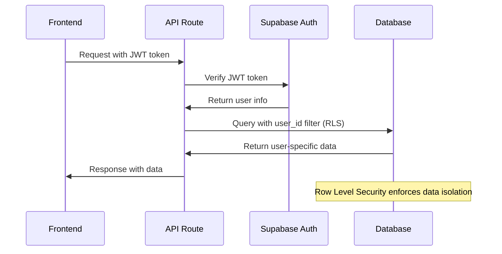

# Backend Architecture

## Service Architecture

### Function Organization
```
api/
├── auth/
│   ├── session.ts              # GET /api/auth/session
│   └── callback.ts             # POST /api/auth/callback
├── cards/
│   ├── generate.ts             # POST /api/cards/generate
│   ├── generation/
│   │   └── [sessionId].ts      # GET /api/cards/generation/{sessionId}
│   ├── [cardId]/
│   │   ├── approve.ts          # POST /api/cards/{cardId}/approve
│   │   └── download.ts         # GET /api/cards/{cardId}/download
│   └── index.ts                # GET /api/cards (user library)
├── user/
│   └── preferences.ts          # GET/PUT /api/user/preferences
├── webhooks/
│   └── openai.ts               # POST /api/webhooks/openai
└── lib/
    ├── auth.ts                 # Authentication utilities
    ├── openai.ts               # OpenAI service client
    ├── supabase.ts             # Database client
    ├── errors.ts               # Error handling utilities
    └── validation.ts           # Request validation schemas
```

### Function Template
```typescript
// api/cards/generate.ts
import { NextRequest, NextResponse } from 'next/server';
import { z } from 'zod';
import { createServerClient } from '@supabase/ssr';
import { OpenAIService } from '@/lib/openai';
import { validateRequest } from '@/lib/validation';
import { handleAPIError } from '@/lib/errors';

// Request validation schema
const GenerateCardSchema = z.object({
  input_prompt: z.string().min(1).max(200),
  card_type: z.enum(['single_word', 'category']),
  generation_params: z.object({
    difficulty_level: z.enum(['beginner', 'intermediate', 'advanced']).default('beginner'),
    age_group: z.enum(['preschool', 'elementary', 'middle_school']).default('elementary'),
    style_preference: z.enum(['cartoon', 'realistic', 'minimalist']).default('cartoon'),
    language: z.string().default('en')
  }).optional().default({})
});

export async function POST(request: NextRequest) {
  try {
    // Validate request and authenticate user
    const { data, user } = await validateRequest(request, GenerateCardSchema);
    
    // Create Supabase client for this request
    const supabase = createServerClient(
      process.env.SUPABASE_URL!,
      process.env.SUPABASE_SERVICE_KEY!,
      {
        cookies: {
          get: (name: string) => request.cookies.get(name)?.value,
        },
      }
    );

    // Check user's generation quota
    const quotaCheck = await checkUserQuota(supabase, user.id);
    if (!quotaCheck.allowed) {
      return NextResponse.json(
        { error: { code: 'QUOTA_EXCEEDED', message: quotaCheck.message } },
        { status: 429 }
      );
    }

    // Create generation session
    const { data: session } = await supabase
      .from('generation_sessions')
      .insert({
        user_id: user.id,
        input_prompt: data.input_prompt,
        generation_type: data.card_type === 'single_word' ? 'single_word_card' : 'category_card',
        status: 'pending'
      })
      .select()
      .single();

    if (!session) {
      throw new Error('Failed to create generation session');
    }

    // Start async generation process
    generateCardAsync(session.id, data, user.id).catch(error => {
      console.error('Background generation failed:', error);
      // Update session with error status
      supabase
        .from('generation_sessions')
        .update({ 
          status: 'failed', 
          error_message: error.message,
          completed_at: new Date().toISOString()
        })
        .eq('id', session.id)
        .execute();
    });

    return NextResponse.json(session);

  } catch (error) {
    return handleAPIError(error);
  }
}

// Background generation function
async function generateCardAsync(
  sessionId: string,
  data: z.infer<typeof GenerateCardSchema>,
  userId: string
) {
  const supabase = createServerClient(
    process.env.SUPABASE_URL!,
    process.env.SUPABASE_SERVICE_KEY!
  );

  const openai = new OpenAIService();

  try {
    // Update session to processing
    await supabase
      .from('generation_sessions')
      .update({ status: 'processing' })
      .eq('id', sessionId);

    // Generate card content with OpenAI
    const cardContent = await openai.generateCardContent({
      prompt: data.input_prompt,
      cardType: data.card_type,
      params: data.generation_params
    });

    // Create card record
    const { data: card } = await supabase
      .from('flash_cards')
      .insert({
        user_id: userId,
        session_id: sessionId,
        title: cardContent.title,
        card_type: data.card_type,
        content: cardContent,
        generation_params: data.generation_params,
        status: 'preview'
      })
      .select()
      .single();

    // Update session as completed
    await supabase
      .from('generation_sessions')
      .update({ 
        status: 'completed',
        ai_costs: cardContent.costs,
        completed_at: new Date().toISOString()
      })
      .eq('id', sessionId);

    // Update user usage tracking
    await updateUserUsage(supabase, userId, cardContent.costs);

  } catch (error) {
    // Update session with error
    await supabase
      .from('generation_sessions')
      .update({ 
        status: 'failed',
        error_message: error.message,
        completed_at: new Date().toISOString()
      })
      .eq('id', sessionId);
    
    throw error;
  }
}

async function checkUserQuota(supabase: any, userId: string) {
  // Implementation for quota checking based on subscription tier
  // Returns { allowed: boolean, message?: string }
}

async function updateUserUsage(supabase: any, userId: string, costs: any) {
  // Implementation for updating usage tracking
}
```

## Database Architecture

### Data Access Layer
```typescript
// lib/repositories/cardRepository.ts
import { createServerClient } from '@supabase/ssr';
import { FlashCard, GenerationSession } from '@/types/cards';

export class CardRepository {
  constructor(private supabase: ReturnType<typeof createServerClient>) {}

  async createGenerationSession(data: {
    user_id: string;
    input_prompt: string;
    generation_type: string;
  }): Promise<GenerationSession> {
    const { data: session, error } = await this.supabase
      .from('generation_sessions')
      .insert(data)
      .select()
      .single();

    if (error) throw new Error(`Failed to create session: ${error.message}`);
    return session;
  }

  async updateSessionStatus(
    sessionId: string, 
    status: string, 
    additional?: { error_message?: string; ai_costs?: any; completed_at?: string }
  ): Promise<void> {
    const { error } = await this.supabase
      .from('generation_sessions')
      .update({ status, ...additional })
      .eq('id', sessionId);

    if (error) throw new Error(`Failed to update session: ${error.message}`);
  }

  async createFlashCard(cardData: Partial<FlashCard>): Promise<FlashCard> {
    const { data: card, error } = await this.supabase
      .from('flash_cards')
      .insert(cardData)
      .select()
      .single();

    if (error) throw new Error(`Failed to create card: ${error.message}`);
    
    // Create associated scenes
    if (cardData.content?.scenes) {
      await this.createCardScenes(card.id, cardData.content.scenes);
    }
    
    return card;
  }

  async createCardScenes(cardId: string, scenes: any[]): Promise<void> {
    const sceneData = scenes.map((scene, index) => ({
      card_id: cardId,
      scene_order: index + 1,
      description: scene.description,
      image_url: scene.image_url,
      image_prompt: scene.image_prompt
    }));

    const { error } = await this.supabase
      .from('card_scenes')
      .insert(sceneData);

    if (error) throw new Error(`Failed to create scenes: ${error.message}`);
  }

  async getUserCards(
    userId: string, 
    options: { page: number; limit: number; card_type?: string }
  ) {
    let query = this.supabase
      .from('flash_cards')
      .select(`
        *,
        card_scenes (
          id,
          scene_order,
          description,
          image_url
        )
      `)
      .eq('user_id', userId)
      .order('created_at', { ascending: false });

    if (options.card_type) {
      query = query.eq('card_type', options.card_type);
    }

    const { data: cards, error, count } = await query
      .range(
        (options.page - 1) * options.limit,
        options.page * options.limit - 1
      );

    if (error) throw new Error(`Failed to fetch cards: ${error.message}`);

    return {
      cards: cards || [],
      pagination: {
        page: options.page,
        limit: options.limit,
        total: count || 0,
        total_pages: Math.ceil((count || 0) / options.limit)
      }
    };
  }

  async approveCard(cardId: string, userId: string): Promise<FlashCard> {
    const { data: card, error } = await this.supabase
      .from('flash_cards')
      .update({ status: 'approved' })
      .eq('id', cardId)
      .eq('user_id', userId) // Ensure user owns the card
      .select()
      .single();

    if (error) throw new Error(`Failed to approve card: ${error.message}`);
    return card;
  }
}
```

## Authentication and Authorization

### Auth Flow


### Middleware/Guards
```typescript
// lib/auth.ts
import { NextRequest } from 'next/server';
import { createServerClient } from '@supabase/ssr';
import { z } from 'zod';

export async function validateRequest<T>(
  request: NextRequest,
  schema: z.ZodSchema<T>
): Promise<{ data: T; user: any }> {
  // Parse and validate request body
  const body = await request.json();
  const data = schema.parse(body);

  // Create Supabase client
  const supabase = createServerClient(
    process.env.SUPABASE_URL!,
    process.env.SUPABASE_ANON_KEY!,
    {
      cookies: {
        get: (name: string) => request.cookies.get(name)?.value,
      },
    }
  );

  // Get user from session
  const { data: { user }, error } = await supabase.auth.getUser();
  
  if (error || !user) {
    throw new AuthError('Authentication required');
  }

  return { data, user };
}

export class AuthError extends Error {
  constructor(message: string) {
    super(message);
    this.name = 'AuthError';
  }
}

// Middleware for protected routes
export async function withAuth(
  request: NextRequest,
  handler: (request: NextRequest, user: any) => Promise<Response>
) {
  try {
    const { user } = await validateRequest(request, z.any());
    return await handler(request, user);
  } catch (error) {
    if (error instanceof AuthError) {
      return new Response(
        JSON.stringify({ error: { code: 'UNAUTHORIZED', message: error.message } }),
        { status: 401, headers: { 'Content-Type': 'application/json' } }
      );
    }
    throw error;
  }
}
```
