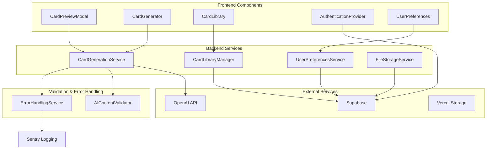

# Components

## CardGenerationService

**Responsibility:** Orchestrates AI-powered card generation workflow including OpenAI API integration, content validation, and generation session management

**Key Interfaces:**
- `generateCard(prompt: string, params: GenerationParams): Promise<GenerationSession>`
- `checkGenerationStatus(sessionId: string): Promise<GenerationSession>`
- `regenerateCard(cardId: string): Promise<GenerationSession>`

**Dependencies:** OpenAI API, Supabase Database, Image Storage Service

**Technology Stack:** Next.js API Routes, OpenAI SDK, Supabase client, TypeScript

## CardPreviewModal

**Responsibility:** Frontend component for displaying generated cards with 3:4 aspect ratio, providing approve/regenerate actions as specified in PRD

**Key Interfaces:**
- `PreviewModalProps { card: FlashCard, onApprove: () => void, onRegenerate: () => void }`
- `usePreviewState() => { isOpen, card, actions }`

**Dependencies:** Chakra UI Modal, Card Display Component, Generation Service

**Technology Stack:** React, TypeScript, Chakra UI, Zustand for modal state

## AuthenticationProvider

**Responsibility:** Manages user authentication state, session persistence, and authorization across the application

**Key Interfaces:**
- `AuthContext { user: User | null, signIn, signOut, updatePreferences }`
- `useAuth() => AuthState`
- `withAuth(Component) => AuthenticatedComponent`

**Dependencies:** Supabase Auth, React Context

**Technology Stack:** React Context, Supabase Auth SDK, TypeScript

## CardLibraryManager

**Responsibility:** Handles card storage, retrieval, organization, and download functionality for user's card collection

**Key Interfaces:**
- `saveCard(card: FlashCard): Promise<FlashCard>`
- `getUserCards(userId: string, pagination: Pagination): Promise<CardLibrary>`
- `downloadCard(cardId: string, format: FileFormat): Promise<Blob>`

**Dependencies:** Supabase Database, File Storage Service, PDF Generation Service

**Technology Stack:** Supabase client, jsPDF for PDF generation, TypeScript

## UserPreferencesService

**Responsibility:** Manages user settings including skip_preview toggle, card preferences, and application configuration

**Key Interfaces:**
- `getPreferences(userId: string): Promise<UserPreferences>`
- `updatePreferences(userId: string, prefs: Partial<UserPreferences>): Promise<UserPreferences>`
- `getSkipPreview(userId: string): Promise<boolean>`

**Dependencies:** Supabase Database, Authentication Provider

**Technology Stack:** Supabase client, React Query for caching, TypeScript

## AIContentValidator

**Responsibility:** Validates and sanitizes AI-generated content for educational appropriateness and quality standards

**Key Interfaces:**
- `validateCardContent(content: CardContent): ValidationResult`
- `sanitizeText(text: string): string`
- `checkImageAppropriate(imageUrl: string): Promise<boolean>`

**Dependencies:** Content moderation APIs, OpenAI moderation endpoint

**Technology Stack:** OpenAI Moderation API, custom validation rules, TypeScript

## FileStorageService

**Responsibility:** Manages image upload, storage, optimization, and CDN distribution for generated card assets

**Key Interfaces:**
- `uploadImage(file: File, metadata: ImageMetadata): Promise<string>`
- `optimizeImage(imageUrl: string): Promise<string>`
- `generateDownloadUrl(cardId: string, format: string): Promise<string>`

**Dependencies:** Supabase Storage, Image optimization service

**Technology Stack:** Supabase Storage SDK, Sharp for image processing, TypeScript

## ErrorHandlingService

**Responsibility:** Centralized error handling, logging, and user-friendly error message translation for AI generation failures

**Key Interfaces:**
- `handleAPIError(error: Error): UserFriendlyError`
- `logGenerationError(sessionId: string, error: Error): void`
- `retryGeneration(sessionId: string): Promise<GenerationSession>`

**Dependencies:** Logging service, Notification system

**Technology Stack:** Sentry for error tracking, custom error types, TypeScript

## Component Diagrams

