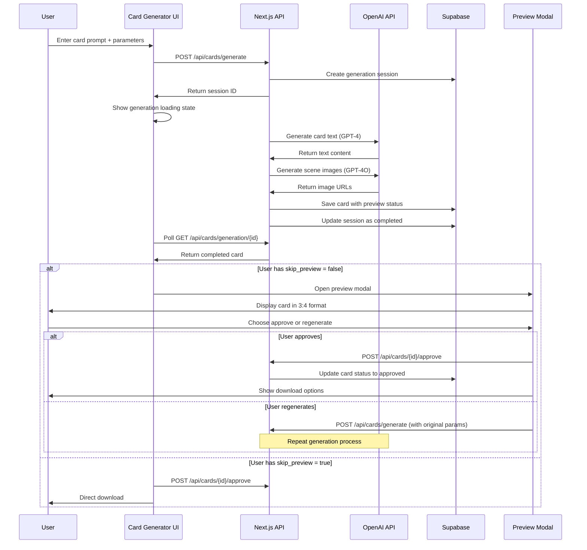
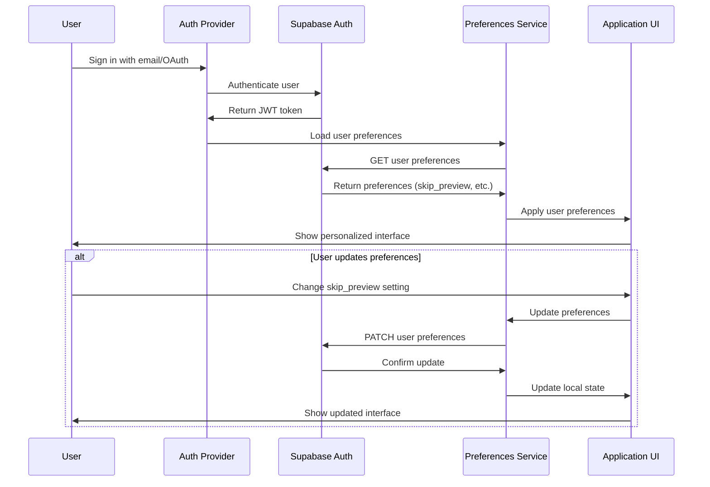
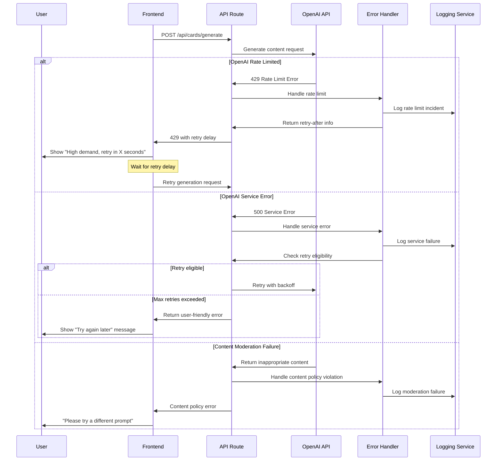

# Core Workflows

## Card Generation with Preview Workflow

```mermaid
sequenceDiagram
    participant U as User
    participant UI as Card Generator UI
    participant API as Next.js API
    participant OpenAI as OpenAI API
    participant SB as Supabase
    participant PM as Preview Modal
    
    U->>UI: Enter card prompt + parameters
    UI->>API: POST /api/cards/generate
    API->>SB: Create generation session
    API->>UI: Return session ID
    UI->>UI: Show generation loading state
    
    API->>OpenAI: Generate card text (GPT-4)
    OpenAI->>API: Return text content
    API->>OpenAI: Generate scene images (GPT-4O)
    OpenAI->>API: Return image URLs
    
    API->>SB: Save card with preview status
    API->>SB: Update session as completed
    
    UI->>API: Poll GET /api/cards/generation/{id}
    API->>UI: Return completed card
    
    alt User has skip_preview = false
        UI->>PM: Open preview modal
        PM->>U: Display card in 3:4 format
        U->>PM: Choose approve or regenerate
        
        alt User approves
            PM->>API: POST /api/cards/{id}/approve
            API->>SB: Update card status to approved
            PM->>U: Show download options
        else User regenerates
            PM->>API: POST /api/cards/generate (with original params)
            Note over API,OpenAI: Repeat generation process
        end
    else User has skip_preview = true
        UI->>API: POST /api/cards/{id}/approve
        UI->>U: Direct download
    end
```

## User Authentication and Preferences Flow

```mermaid
sequenceDiagram
    participant U as User
    participant Auth as Auth Provider
    participant SB as Supabase Auth
    participant Prefs as Preferences Service
    participant UI as Application UI
    
    U->>Auth: Sign in with email/OAuth
    Auth->>SB: Authenticate user
    SB->>Auth: Return JWT token
    Auth->>Prefs: Load user preferences
    Prefs->>SB: GET user preferences
    SB->>Prefs: Return preferences (skip_preview, etc.)
    Prefs->>UI: Apply user preferences
    UI->>U: Show personalized interface
    
    alt User updates preferences
        U->>UI: Change skip_preview setting
        UI->>Prefs: Update preferences
        Prefs->>SB: PATCH user preferences
        SB->>Prefs: Confirm update
        Prefs->>UI: Update local state
        UI->>U: Show updated interface
    end
```

## Error Handling and Retry Workflow

```mermaid
sequenceDiagram
    participant U as User
    participant UI as Frontend
    participant API as API Route
    participant OpenAI as OpenAI API
    participant Error as Error Handler
    participant Log as Logging Service
    
    UI->>API: POST /api/cards/generate
    API->>OpenAI: Generate content request
    
    alt OpenAI Rate Limited
        OpenAI->>API: 429 Rate Limit Error
        API->>Error: Handle rate limit
        Error->>Log: Log rate limit incident
        Error->>API: Return retry-after info
        API->>UI: 429 with retry delay
        UI->>U: Show "High demand, retry in X seconds"
        
        Note over UI: Wait for retry delay
        UI->>API: Retry generation request
    else OpenAI Service Error
        OpenAI->>API: 500 Service Error
        API->>Error: Handle service error
        Error->>Log: Log service failure
        Error->>API: Check retry eligibility
        
        alt Retry eligible
            API->>OpenAI: Retry with backoff
        else Max retries exceeded
            API->>UI: Return user-friendly error
            UI->>U: Show "Try again later" message
        end
    else Content Moderation Failure
        OpenAI->>API: Return inappropriate content
        API->>Error: Handle content policy violation
        Error->>Log: Log moderation failure
        API->>UI: Content policy error
        UI->>U: "Please try a different prompt"
    end
```
