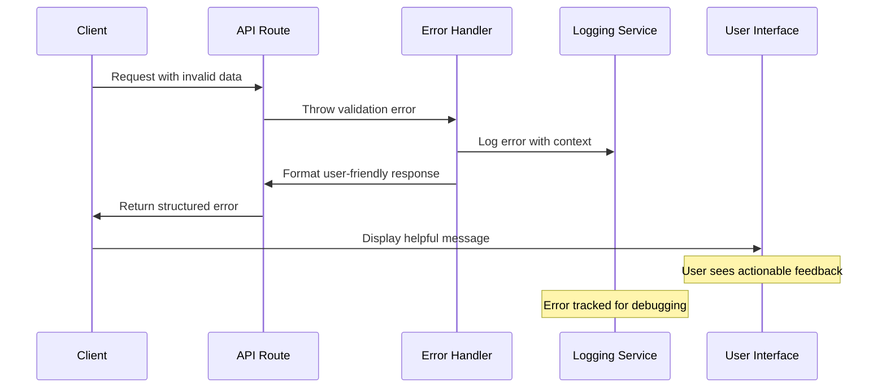

# Error Handling Strategy

## Error Flow



## Error Response Format

```typescript
interface ApiError {
  error: {
    code: string;
    message: string;
    details?: Record<string, any>;
    timestamp: string;
    requestId: string;
  };
}
```

## Frontend Error Handling

```typescript
// lib/errors/errorHandler.ts
import { toast } from '@chakra-ui/react';
import { ApiError } from '@/types/api';

export class ErrorHandler {
  static handle(error: unknown): void {
    if (error instanceof ApiError) {
      this.handleApiError(error);
    } else if (error instanceof Error) {
      this.handleGenericError(error);
    } else {
      this.handleUnknownError();
    }
  }

  private static handleApiError(error: ApiError): void {
    const { code, message } = error.error;
    
    switch (code) {
      case 'QUOTA_EXCEEDED':
        toast({
          title: 'Generation Limit Reached',
          description: message,
          status: 'warning',
          duration: 5000,
          isClosable: true,
        });
        break;
        
      case 'CONTENT_POLICY_VIOLATION':
        toast({
          title: 'Content Policy Issue',
          description: 'Please try a different prompt that\'s appropriate for children.',
          status: 'error',
          duration: 7000,
          isClosable: true,
        });
        break;
        
      case 'GENERATION_FAILED':
        toast({
          title: 'Generation Failed',
          description: 'Our AI service is having trouble. Please try again in a moment.',
          status: 'error',
          duration: 5000,
          isClosable: true,
        });
        break;
        
      default:
        this.handleGenericError(new Error(message));
    }
  }

  private static handleGenericError(error: Error): void {
    toast({
      title: 'Something went wrong',
      description: error.message || 'An unexpected error occurred.',
      status: 'error',
      duration: 5000,
      isClosable: true,
    });
  }

  private static handleUnknownError(): void {
    toast({
      title: 'Unexpected Error',
      description: 'Something unexpected happened. Please refresh and try again.',
      status: 'error',
      duration: 5000,
      isClosable: true,
    });
  }
}

// Hook for error handling in components
export const useErrorHandler = () => {
  return {
    handleError: ErrorHandler.handle,
    handleApiError: (error: ApiError) => ErrorHandler.handle(error),
  };
};
```

## Backend Error Handling

```typescript
// lib/errors.ts
import { NextResponse } from 'next/server';
import { ZodError } from 'zod';
import { v4 as uuidv4 } from 'uuid';

export class APIError extends Error {
  constructor(
    public code: string,
    message: string,
    public statusCode: number = 500,
    public details?: Record<string, any>
  ) {
    super(message);
    this.name = 'APIError';
  }
}

export class ValidationError extends APIError {
  constructor(message: string, details?: Record<string, any>) {
    super('VALIDATION_ERROR', message, 400, details);
  }
}

export class AuthenticationError extends APIError {
  constructor(message: string = 'Authentication required') {
    super('UNAUTHORIZED', message, 401);
  }
}

export class QuotaExceededError extends APIError {
  constructor(message: string = 'Generation quota exceeded') {
    super('QUOTA_EXCEEDED', message, 429);
  }
}

export class ContentPolicyError extends APIError {
  constructor(message: string = 'Content violates policy') {
    super('CONTENT_POLICY_VIOLATION', message, 400);
  }
}

export function handleAPIError(error: unknown): NextResponse {
  const requestId = uuidv4();
  const timestamp = new Date().toISOString();

  // Log error for debugging
  console.error(`[${requestId}] API Error:`, error);

  if (error instanceof APIError) {
    return NextResponse.json(
      {
        error: {
          code: error.code,
          message: error.message,
          details: error.details,
          timestamp,
          requestId,
        },
      },
      { status: error.statusCode }
    );
  }

  if (error instanceof ZodError) {
    return NextResponse.json(
      {
        error: {
          code: 'VALIDATION_ERROR',
          message: 'Request validation failed',
          details: error.flatten(),
          timestamp,
          requestId,
        },
      },
      { status: 400 }
    );
  }

  // Generic error response
  return NextResponse.json(
    {
      error: {
        code: 'INTERNAL_SERVER_ERROR',
        message: 'An unexpected error occurred',
        timestamp,
        requestId,
      },
    },
    { status: 500 }
  );
}
```
