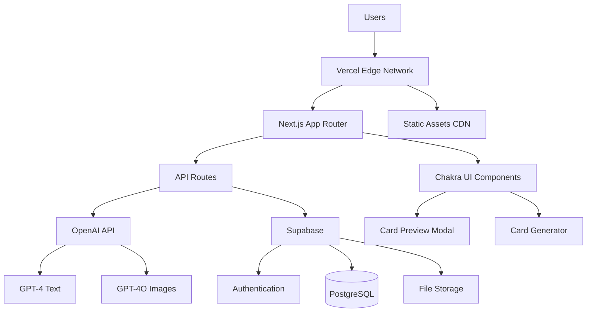

# High Level Architecture

## Technical Summary

The English Flash Cards Generator will be built as a **modern Jamstack application** using Next.js with App Router, providing server-side rendering for optimal performance and SEO. The frontend leverages Chakra UI for rapid component development and consistent design, while the backend utilizes **Supabase's serverless architecture** for authentication, PostgreSQL database, and real-time capabilities. **OpenAI API integration** serves as the core AI engine for both text generation (GPT-4) and image generation (GPT-4O), orchestrated through Next.js API routes. The application deploys on **Vercel's edge network** for global performance, with the architecture specifically designed to support the card preview enhancement workflow outlined in the PRD.

## Platform and Infrastructure Choice

**Platform:** Vercel + Supabase
**Key Services:** Vercel Edge Functions, Supabase Database + Auth + Storage, OpenAI API
**Deployment Host and Regions:** Vercel global edge network with primary regions in US-East, EU-West

## Repository Structure

**Structure:** Monorepo with Next.js App Router
**Monorepo Tool:** Native Next.js workspace (no additional tooling needed)
**Package Organization:** Single Next.js application with modular internal structure

## High Level Architecture Diagram

## Architectural Patterns

- **Jamstack Architecture:** Static generation with serverless API routes - *Rationale:* Optimal performance and SEO for educational content with dynamic AI generation capabilities
- **Component-Based UI:** Reusable React components with TypeScript - *Rationale:* Maintainability and type safety across large codebases, essential for educational UI components
- **Serverless API Pattern:** Next.js API routes with edge functions - *Rationale:* Scales automatically with AI processing demands and reduces operational overhead
- **Repository Pattern:** Abstract data access logic through Supabase client - *Rationale:* Enables testing and future database migration flexibility
- **Provider Pattern:** React Context for state management - *Rationale:* Simple state sharing for preview modal and generation workflow without over-engineering
- **API Gateway Pattern:** Centralized API route handling - *Rationale:* Unified error handling, rate limiting, and OpenAI request orchestration
